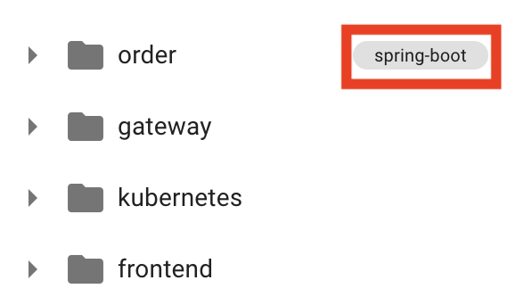
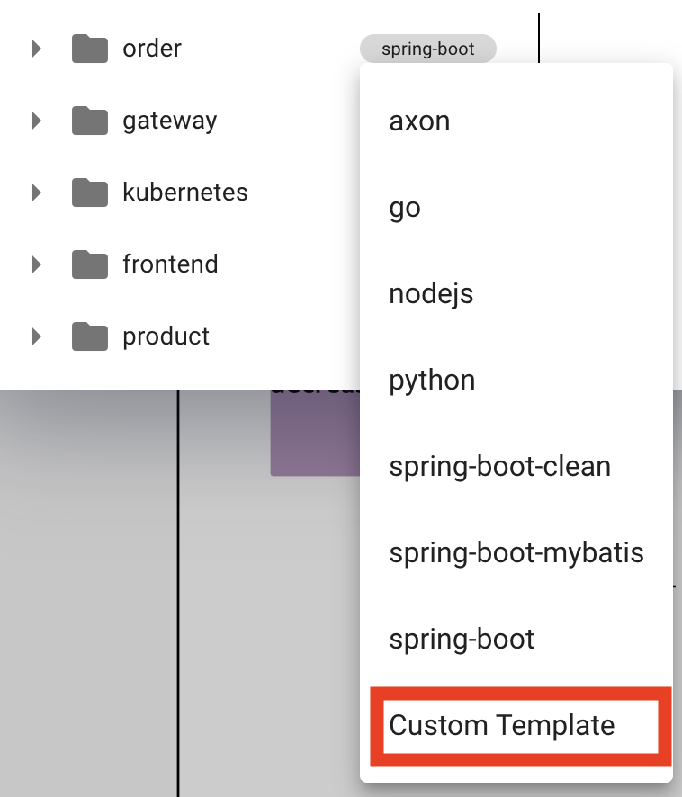
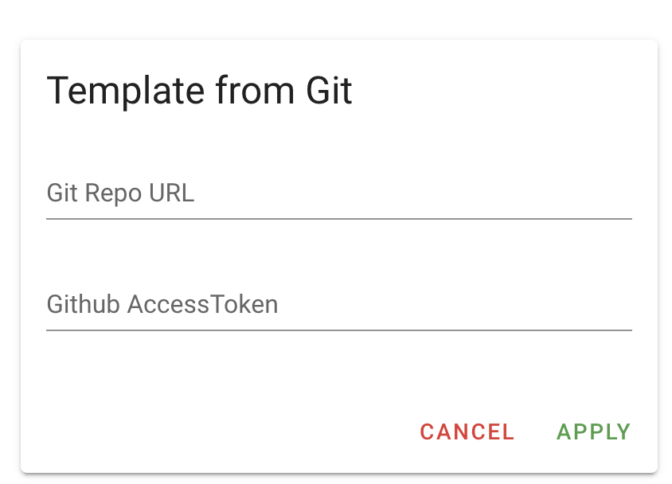
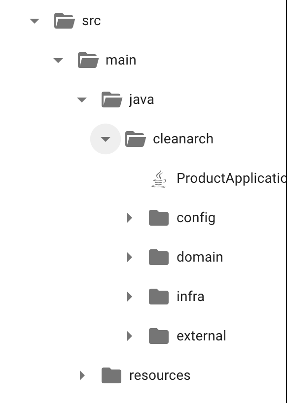
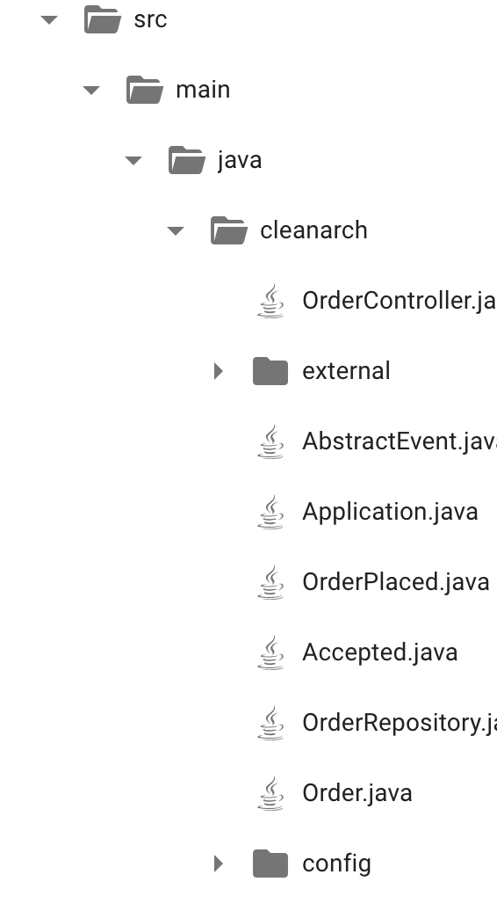

# 커스텀 템플릿 튜토리얼

## 커스텀 템플릿 설정하기 

- 위 사진과 같이 Code Preview에서 좌측 서비스명 옆 spring-boot 클릭 

- 위 사진과 같이 Custom Template으로 설정 한다. 

- Git Repo URL에 Template이 존재하는 Git Repository URL 입력  
예제) https://github.com/msa-ez/template-spring-boot-default  
해당 Repository를 fork 후 자신의 repository url을 입력 

- Github Access Token 발급 후 access token을 Github access token란에 입력  
(Github Access Token 발급 방법 : https://kim-dragon.tistory.com/122)

 
- 기존 템플릿

- 커스텀 템플릿