# 강의 개발 및 실습 환경

<iframe style = "width:100%; height:100%;" src="https://www.youtube.com/embed/Le0a-NH6xwQ" title="YouTube video player" frameborder="0" allow="accelerometer; autoplay; clipboard-write; encrypted-media; gyroscope; picture-in-picture" allowfullscreen></iframe>

## 강의 개발

### · 강의 생성

**[강의 생성](http://www.msaez.io/#/courses) 클릭 -> 강의 생성 탭으로 이동**

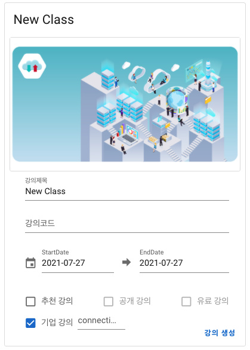

| 번호 | 이름                | 기능 설명                                                                 |
| ---- | ------------------- | ------------------------------------------------------------------------- |
| 1    | 강의 제목           | 강의에 사용할 강의 대표 타이틀입니다.                                     |
| 2    | 강의 코드           | 강의를 생성할 때 가지고 있는 고유 코드입니다.(중복생성 불가능)            |
| 3    | Start Date          | 강의의 시작 날짜를 지정 할 수 있습니다.                                   |
| 4    | End Date            | 강의의 끝나는 날짜를 지정 할 수 있습니다.                                 |
| 5    | 추천 강의           | 체크 시 강의를 추천 강의 탭에 띄웁니다.                                   |
| 6    | 공개 강의           | 체크 시 강의를 공개 강의 탭에 띄웁니다.                                   |
| 7    | 유료 강의           | 체크 시 강의를 유료 강의로 생성 할 수 있습니다.                           |
| 8    | 기업 강의           | 체크 시 강의를 기업 강의 탭에 띄웁니다.                                   |
| 9    | connection Key      | 강의 입장 비밀번호 입니다.                                                |
| 10   | 강의 생성           | 클릭 시 위 설정대로 강의가 생성 됩니다.                                   |

---

### · lab 생성

| 번호 | 이름                | 기능 설명                                                                 |
| ---- | ------------------- | ------------------------------------------------------------------------- |
| 1    | lab-Id              | lab의 고유 Id                                                             |
| 2    | lab-Name            | lab의 대표 타이틀                                                         |
| 3    | lab-Scenario        | lab에 대한 설명                                                           |
| 4    | tool                | lab에 활용할 tool                                                         |
| 5    | lab-price           | 유료 강의 생성 시 가격 부여                                               |

<h3>lab-tool</h3>

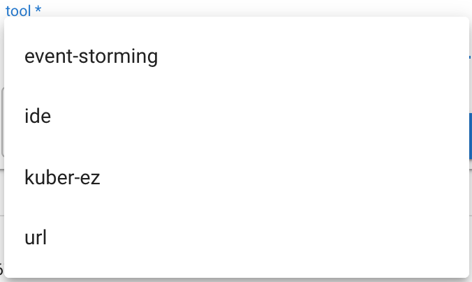

| 번호 | 이름                | 기능 설명                                                                 |
| ---- | ------------------- | ------------------------------------------------------------------------- |
| 1    | event-storming      | 생성된 랩 입장 시 이벤트 스토밍 툴 사용                                   |
| 2    | ide                 | 생성된 랩 입장 시 웹 Visual Studio를 이용한 툴 사용                       |
| 3    | kuber-ez            | 생성된 랩 입장 시 kuber-ez 툴 사용                                        |
| 4    | url                 | 생성된 랩 입장 시 Electron 수업 진행 시 사용                              |

### · lab 위치 이동 및 삭제

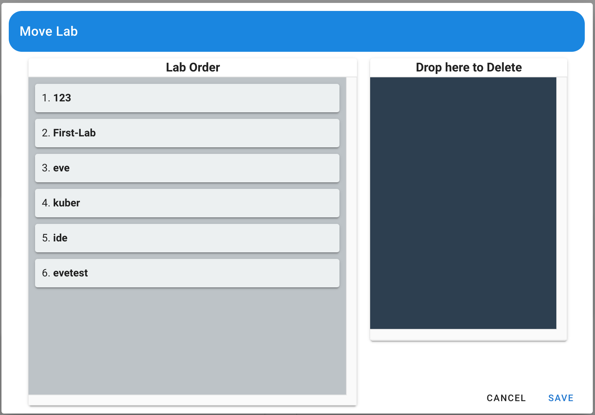

| 번호 | 이름                | 기능 설명                                                                           |
| ---- | ------------------- | ----------------------------------------------------------------------------------- |
| 1    | Lab Order           | 마우스 드래그로 순서 조절 가능                                                      |
| 2    | Drop here to Delete | Lab Order 의 lab를 우측 Drop here to Delete 이동시 제거 (실제로는 제거되지 않음) |
| 3    | CANCLE              | 기능 조작 하더라도 CANCLE 버튼을 누르면 최초 상태로 리셋                            |
| 4    | SAVE                | 기능 조작 후 SAVE 버튼 클릭시 최종 반영                                             |

### · instruction 편집
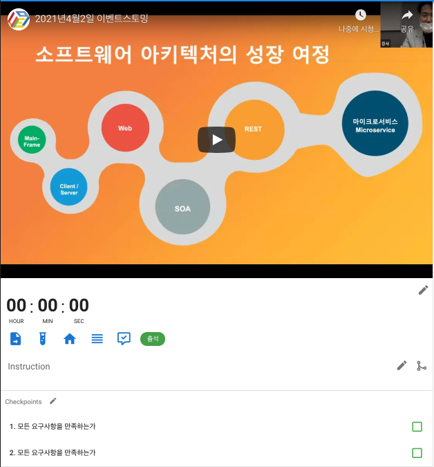

<h3> · lab에 활용할 영상 삽입</h3>

**영상 하단의 팬 모양 아이콘 클릭 시 영상 삽입 URL 입력창 출력**
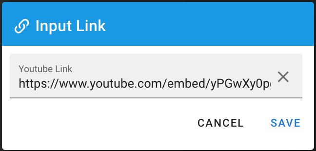

<h3> · Instruction 내용 편집</h3>

**Instruction 우측 끝의 팬 모양 아이콘 클릭 시 내용 편집 가능 Markdown 형식 사용**
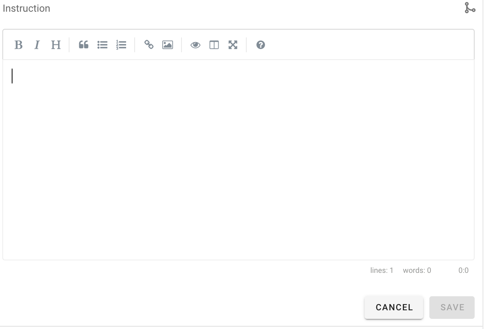

<h3> · Instruction 내용 Merge</h3>

**Instruction 우측 끝의 팬 모양 옆 아이콘 클릭 시 다른 사람의 Instruction 내용 merge 기능 사용 가능**
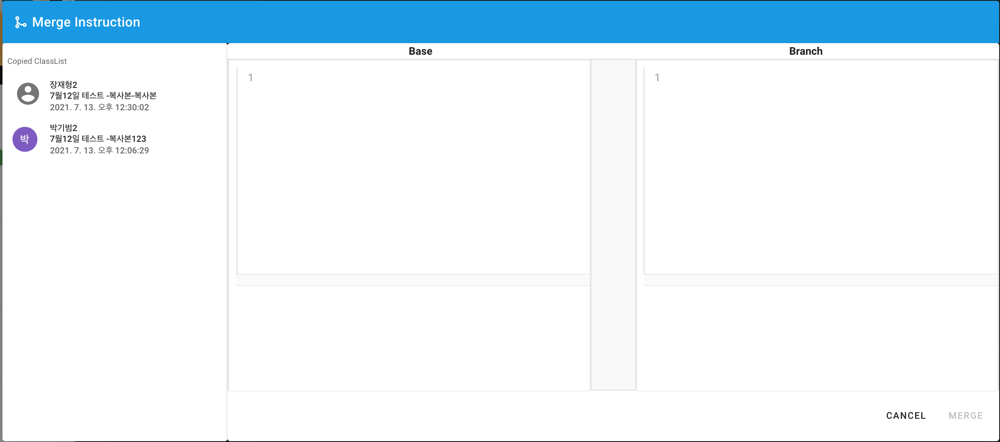

### · 콘텐츠 저장

**강의에 활용할 자료(code, modeling) 등을 작업해놓고 아이콘 클릭 시 lab에 관련 data를 저장하는 기능**

### · quiz 편집

**강의 문제 편집 내고 싶은 문제를 연필 아이콘을 클릭하여 편집 후 기재**
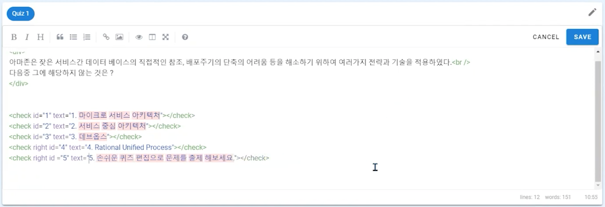

## 강의 진행

### · 조별 편성
**그룹 추가 버튼 클릭 시 그룹 추가 UI 생성**

   

**생성된 UI에 유저를 마우스 드래그로 끌어 놓으면 같이 있는 유저끼리 그룹화**
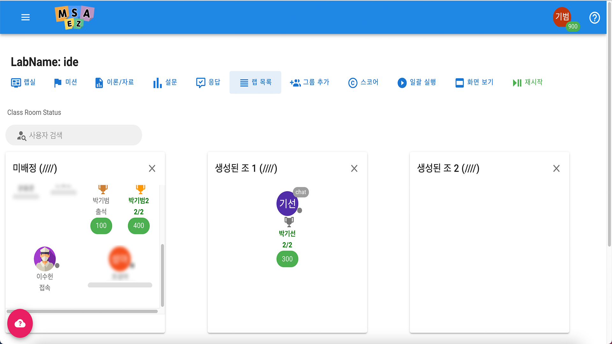

### · 채팅
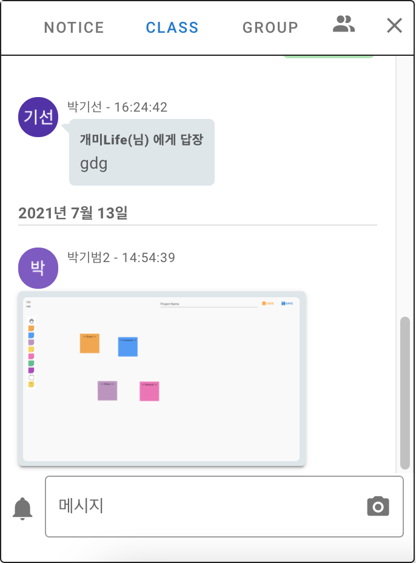

| 번호 | 이름                | 기능 설명                                                         |
| ---- | ------------------- | ----------------------------------------------------------------- |
| 1    | NOTICE | 강사가 작성한 공지 사항 (강사만 입력 가능)                                     |
| 2    | CLASS | 참가 중인 모든 유저와 대화 가능한 UI                                            |
| 3    | GROUP | 그룹화 유저끼리만 채팅 가능한 UI                                                |
| 4    |  | 현재 보고 있는 화면 캡처 아이콘    |
| 5    |  | 채팅 알림을 켜고 끌 수 있는 아이콘 |

### · 오류 지원

**채팅으로 유저 질문 확인 후 classRoom 에서 유저 아이콘 클릭 시 별도의 UI 창 출력**

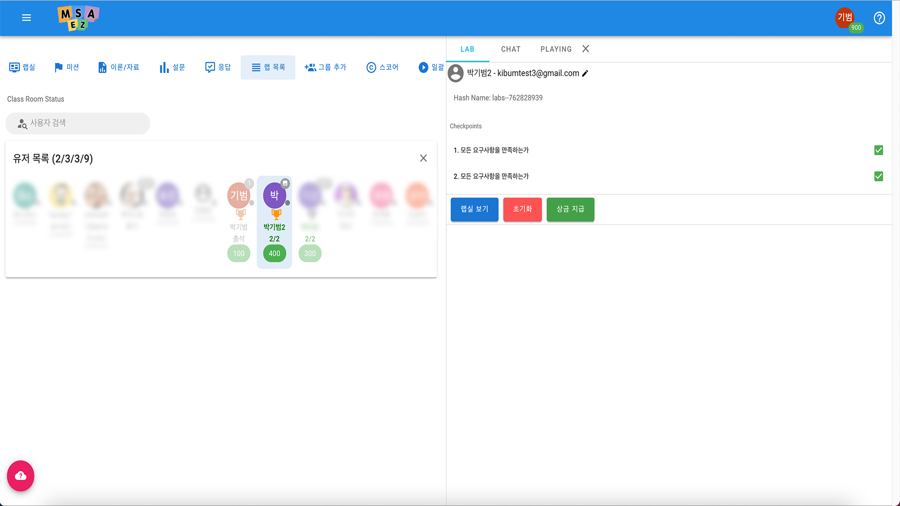
   

**출력된 UI 창에서 랩실 보기 클릭 시 유저의 랩실 내에 발생한 문제점을 볼 수 있습니다.**

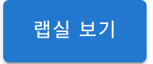

### · 결과 제출

**수강생은 실습 완료 후 Labs 탭 - 결과 제출을 클릭해 줍니다.**

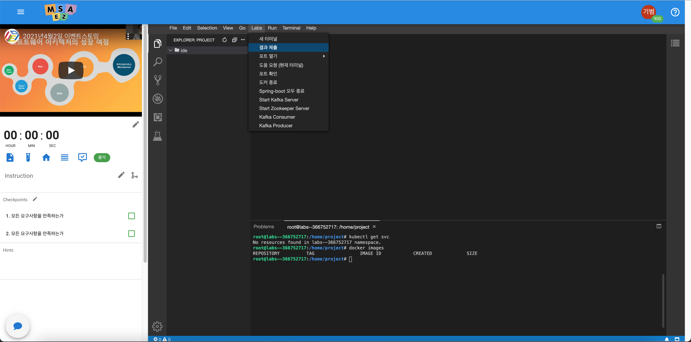

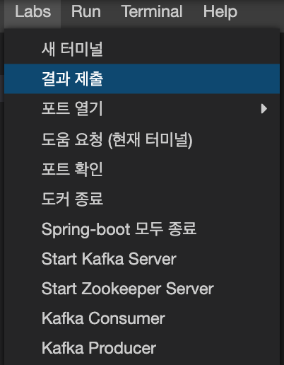

**이후 해당 아이콘을 클릭하여 결과 제출을 완료해 줍니다.**

**강사는 classroom에서 유저의 아이콘을 클릭 - LAB 탭에서 제출된 정보를 확인 할 수 있습니다.**

## 수강생 관리

### · 보상 지급

**강사는 classroom에서 유저의 아이콘을 클릭 - LAB 탭에서 상금 지급 버튼을 클릭하여 상금을 지급 할 수 있습니다.**

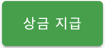

**강사는 classroom에서 시작 버튼을 클릭한 후 종료 버튼 클릭 시 코인 입력 얼랏창이 출력됩니다.**

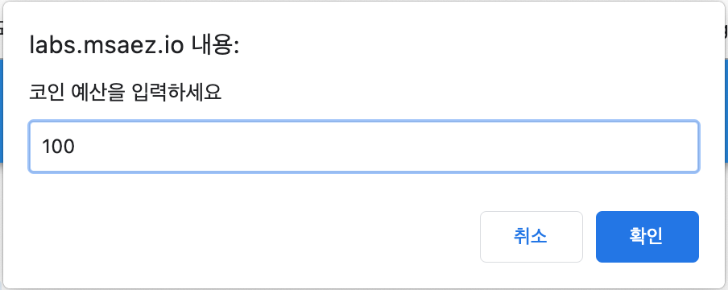

**체크포인트 활성화된 유저는 순위에 맞추어 최대 얼랏창에 입력된 코인을 획득합니다.**
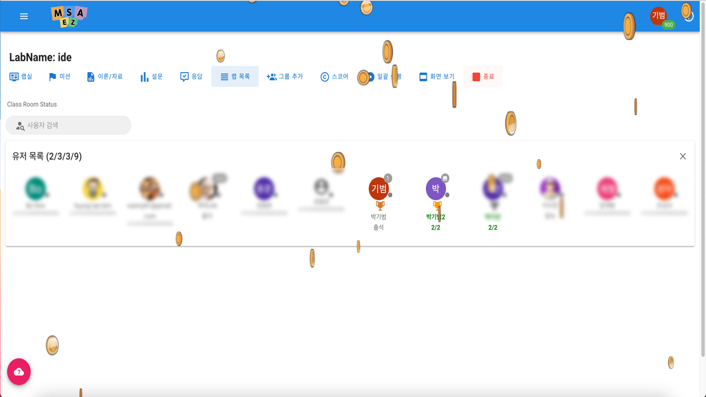

### · 사용료 조회

**우측 상단 자신의 로그인 아이콘에 마우스를 올렸을 때 나오는 리스트에서 구매/사용 목록 리스트에서 구매/사용 목록을 확인 할 수 있습니다.**
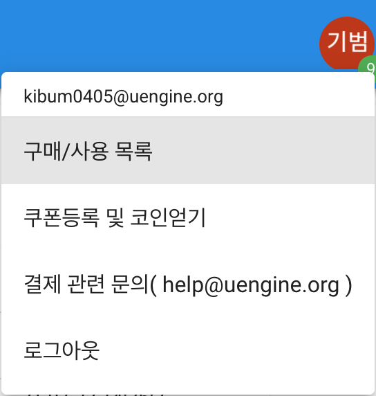

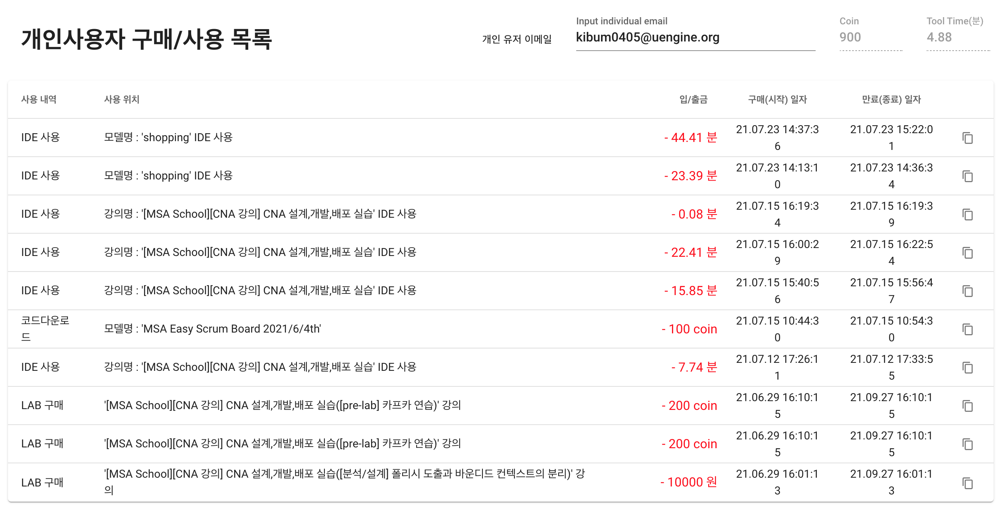

### · 쿠폰 발행 및 사용, 조회

**우측 상단 자신의 로그인 아이콘에 마우스를 올렸을 때 나오는 리스트에서 쿠폰등록 및 코인얻기 를 클릭하면 획득한 쿠폰을 사용 할 수 있는 입력창이 열립니다. (사용한 쿠폰 목록은 구매/사용 목록 리스트에서 확인 할 수 있습니다.)**

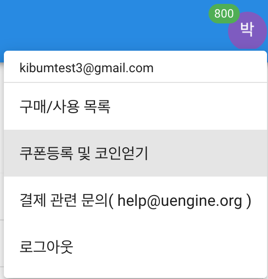

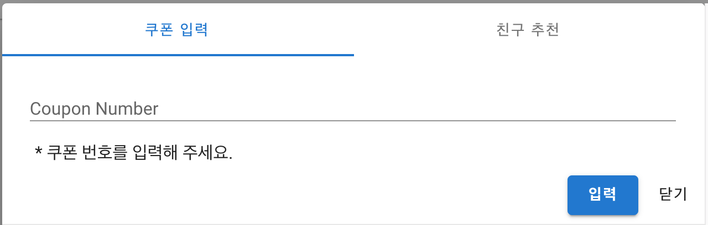