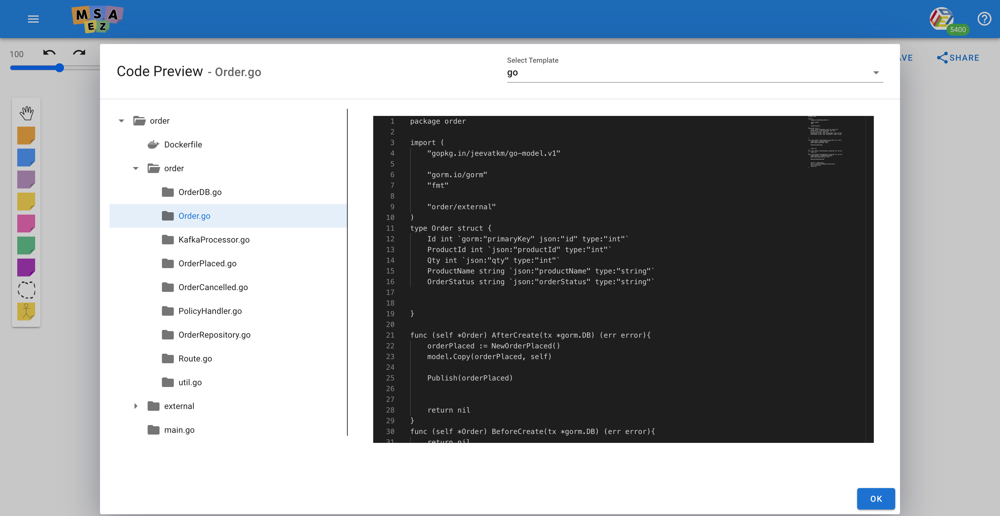
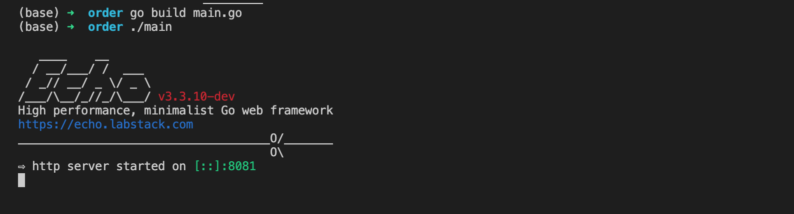

# Go Template 만들기

## Go DDD tutorial 

### Model


<h4> Order </h4>

- Order의 event는 OrderPlaced, OrderCancelled 두개이다. OrderPlaced는 PostPersist로 trigger를 설정하였고 OrderCancelled는 PreRemove로 trigger를 설정하였다. 
- OrderPlaced 즉, 주문됨이라는 event는 Pub/Sub 통신으로 kafka channel에 event를 발행하여 Delivery Service와 통신한다. 
- OrderCancelled 즉, 주문 취소됨 이라는 event는 Res/Req 통신으로 REST API로 Delivery Service와 통신한다. Delivery Service 안에서의 DeliveryCancelled logic이 선행 되고 나서야 OrderCancelled의 logic이 수행된다. 

<h4> Delivery </h4>

- Delivery의 event는 DeliveryStarted, DeliveryCancelled 두개이다. DeliveryStarted는 PostPersist로 trigger를 설정하였고 DeliveryCanclled는 PreRemove로 trigger를 설정하였다. 

### Code 



EventStorming 된 화면에서 우측 상단의 code를 클릭하고 언어를 go로 설정하면 위와 같은 code가 생성된다. 이를 다운 받고 싶으면 Download Archive를 클릭하면 된다. 

### Test 



<h4> Application 구동하기 </h4>

1. 다운로드 받은 파일 위치로 이동한 후 현재 directory에 main.go 가 있는지 확인 한다. 
2. Application을 구동하기 위한 module을 다운 받기 위해 아래와 같은 명령어를 수행한다. (main.go가 있는 위치에서)
```bash
go mod init [프로젝트 명]
go mod tidy 
```
3. main.go가 있는 위치에서 아래와 같은 명령어를 수행하여 binary 파일 생성 
```bash
go build main.go
```
4. 위 명령어를 통해 생성된 binary 파일을 run 하기 위해 아래와 같은 명령어 수행. 
```bash
./main
``

## Go 기술 Stack 

- Web Framework : echo

- ORM : gorm

- Kafka : confluent-kafka-go

- DB : SQlite

- REST Api : resty

## Template code 만들기에 앞서 

Go Template은 Spring-boot Template을 기반으로 만들어졌다. Java와 언어적으로 다른 부분에 대해서는 상세 설명에서 기술 할 것이다. Spring-boot 에는 library로 제공되는 기능들 중 go에 없는 기능들은 따로 구현 해놓았다. 

## Go template 파일 구조

Go template 또한 Spring boot과 마찬가지로 model driven하게 code가 generate 된다. 
Spring-boot와 Go의 비교는 아래와 같다. 

| 역할 | Spring boot | Go |
|-----|-------------|----|
|Aggregate | Entity.java | Entity.go|
|Event | Event.java | Event.go | 
|PolicyHandler | PolicyHandler.java | PolicyHandler.go | 
|PolicyEvent | PolicyEvent.java | PolicyEvent.go |
|ExternalEntity | ExternalEntity.java | ExternalEntity.go |
|ExternalService | ExternalService.java | ExternalService.go |
|Repository | Repoistory.java | Repository.go |
|Controller | Controller.java | Route.go | 
|Application | Application.java | main.go |
|Kafka | | KafkaProcessor.go | 
|DB | | DB.go | 
|utility | | Util.go | 

## Model 별 Template 설명 

- 현 섹션에는 eventstorming을 통해 나온 model들을 기반으로 model driven 하게 generate 되는 code들에 대한 설명이다. 

### · Entity.go

- Aggregate code 만들기 

```go
forEach: Aggregate
fileName: {{namePascalCase}}.go
path: {{boundedContext.name}}/{{boundedContext.name}}
---
package {{boundedContext.name}}

{{#eventsExists events}}
import (
	"gopkg.in/jeevatkm/go-model.v1"
	
	"gorm.io/gorm"
	{{#commandValueExists events}}
	"fmt"

	"order/external"
	{{/commandValueExists}}
)
{{/eventsExists}}
type {{namePascalCase}} struct {
	{{#aggregateRoot.fieldDescriptors}}
    {{#isKey}}
	{{namePascalCase}} int `gorm:"primaryKey" json:"id" type:"int"`
	{{/isKey}}
	{{^isKey}}
	{{namePascalCase}} {{#typeCheck className}} {{/typeCheck}} `json:"{{nameCamelCase}}" type:"{{#typeCheck className}}{{/typeCheck}}"`
	{{/isKey}}
	{{/aggregateRoot.fieldDescriptors}}
	
	
}

{{#lifeCycles}}
func (self *{{../namePascalCase}}) {{#triggerCheck trigger}}{{/triggerCheck}}(tx *gorm.DB) (err error){
	{{#events}}
	{{nameCamelCase}} := New{{namePascalCase}}()
	model.Copy({{nameCamelCase}}, self)

	Publish({{nameCamelCase}})
	
	{{#relationCommandInfo}}
        {{#commandValue}}
	{{aggregate.nameCamelCase}} = &{{aggregate.namePascalCase}}{}
	resp := external.{{namePascalCase}}({{aggregate.nameCamelCase}})
	fmt.Println(resp)
		{{/commandValue}}
	{{/relationCommandInfo}}
	{{/events}}
	return nil
}
{{/lifeCycles}}

<function>
    window.$HandleBars.registerHelper('typeCheck', function (className) {
        if(className.endsWith("String")){
            return "string"
        }
		else if(className.endsWith("Integer")){
			return "int"
		}
		else if(className.endsWith("Float")){
			return "float64"
		}
		else if(className.endsWith("Long")){
			return "int"
		}
		else if(className.ensWith("Boolean")){
			return "bool"
		}
		else if(className.ensWith("Double")){
			return "int"
		}
		
    });

	window.$HandleBars.registerHelper('triggerCheck', function (trigger) {
        if(trigger.endsWith("PreRemove")){
            return "BeforeDelete"
        }
        else if(trigger.endsWith("PostRemove")){
            return "AfterDelete"
        }
		else if(trigger.endsWith("PrePersist")){
			return "BeforeCreate"
		}
		else if(trigger.endsWith("PostPersist")){
			return "AfterCreate"
		}
		else if(trigger.endsWith("PreUpdate")){
			return "BeforeUpdate"
		}
		else{
			return "AfterUpdate"
		}
    });

	window.$HandleBars.registerHelper('eventsExists', function (events, options) {
		if(Object.values(events) != ""){
			return options.fn(this)
        }
        else{
            return options.inverse(this)
        }
		
	});

	window.$HandleBars.registerHelper('commandValueExists', function(events, options){
		for(var ele in events){
			if(events[ele]['relationCommandInfo'].length!=0){
				return options.fn(this)
			}
		}
		return options.inverse(this)
		
	})
</function>
```

<h4> HandlerBar function </h4>

- typeCheck 

Entity의 attribute type들이 java 기준으로 되어 있어 Go에 맞는 type으로 변환시켜 준다. 

- eventsExists 

Aggregate에 연결된 event들이 있는지 확인 한다. 
Go에선 import를 하고 사용하지 않으면 build error가 나기 때문에 event가 있으면 import하고 없으면 import를 하지 않게 해준다. 

- commandValueExists 

res/req 통신이 있는지 확인 한다. 
있다면 external를 import하고 없으면 external를 import하지 않는다. 

- triggerCheck 

event에서의 trigger를 확인한 후 Go에 맞는 trigger로 변환해준다. 

| Java 			| Go 		|
|---------------|-----------|
|PostPersist 	|afterCreate|
|PrePersist 	|beforeCreate|
|PostUpdate 	|afterUpdate|
|PreUpdate 		|beforeUpdate|
|PostDelete		|afterDelete|
|PreDelete		|beforeDelete|

<h4> 세부 사항 </h4>

- Aggregate 당 하나의 Entity.go 파일을 만든다. 
- Event 객체들은 lifeCycles 객체 안에 들어 있다. (Events 객체도 독립적으로 사용가능)
- lifeCycles 안의 trigger는 annotation 형태의 trigger가 아닌 trigger의 이름만 가지고 있다. 
- Event와 연결되어 있는 command 들은 relationCommandInfo 객체에 정보가 저장되어 있고, 각 command 정보를 가져오려면 relationCommandInfo 안 commandValue 객체로 가져와야 한다. 

---

### · Event.go

- Event code 만들기 

```go
forEach: Event
fileName: {{namePascalCase}}.go
path: {{boundedContext.name}}/{{boundedContext.name}}
---
package {{boundedContext.name}}

import (
	"time"
)

type {{namePascalCase}} struct{
	EventType string	`json:"eventType" type:"string"`
	TimeStamp string 	`json:"timeStamp" type:"string"`
	{{#fieldDescriptors}}
	{{namePascalCase}} {{#typeCheck className}} {{/typeCheck}} `json:"{{nameCamelCase}}" type:"{{#typeCheck className}}{{/typeCheck}}"` 
	{{/fieldDescriptors}}
	
}

func New{{namePascalCase}}() *{{namePascalCase}}{
	event := &{{namePascalCase}}{EventType:"{{namePascalCase}}", TimeStamp:time.Now().String()}

	return event
}

<function>
    window.$HandleBars.registerHelper('typeCheck', function (className) {
        if(className.endsWith("String")){
            return "string"
        }
		else if(className.endsWith("Integer")){
			return "int"
		}
		else if(className.endsWith("Float")){
			return "float64"
		}
		else if(className.endsWith("Long")){
			return "int"
		}
		else if(className.ensWith("Boolean")){
			return "bool"
		}
		else if(className.ensWith("Double")){
			return "int"
		}
		
    });
</function>
```

<h4> 세부 사항 </h4>

- 하나의 Event 당 하나의 Event.go 파일을 만든다. 
- typeCheck라는 handleBar function은 Entity.go 와 같이 go에 맞는 변수형으로 만들어준다. 
- Spring boot code에선 Event 객체는 abstractEvent 객체를 상속 받아 사용되는데 Go에선 상속의 개념이 없어 abstractEvent의 주요 기능들은 모두 Util.go 안에 여러 함수들로 추가 구현 되어 있다. 

### · PolicyHandler.go

- Pub/Sub으로 연결된 policyHandler code를 만들기

```go
forEach: BoundedContext
fileName: PolicyHandler.go
path: {{name}}/{{name}}
---
package {{name}}

{{#policyExists policies}}
import (
	"github.com/mitchellh/mapstructure"
)
{{/policyExists}}

{{#policies}}
{{#relationEventInfo}}
func whenever{{eventValue.namePascalCase}}_{{../namePascalCase}}(data map[string]interface{}){
	
	event := New{{eventValue.namePascalCase}}()
	mapstructure.Decode(&event,data)
	{{#../../aggregates}}
	{{nameCamelCase}} := &{{namePascalCase}}{}
	{{nameCamelCase}}repository.save({{nameCamelCase}})
	{{/../../aggregates}}
	
}

{{/relationEventInfo}}
{{/policies}}

<function>
	window.$HandleBars.registerHelper('policyExists', function (policies, options) {
		if(Object.values(policies) != ""){
			return options.fn(this)
        }
        else{
            return options.inverse(this)
        }
		
	});
</function>
```

<h4> HandleBar function </h4>

- policyExists

연결된 Policy가 존재하는지 판단하는 handleBar 함수
연결된 policy가 존재할 때만 mapstructure를 import 한다. 

<h4> 세부사항 </h4>

 - policies라는 객체 안에 연결된 policyHandler에 대한 정보들이 있다. 
 - 해당 policyHandler와 연결된 Event 객체에 대한 정보는 relationEventInfo 객체에 들어 있다. 
 - 각 Event 객체의 세부 정보는 relationEventInfo 안 eventValue 안에 들어 있다. 
 - Spring boot code에는 PolicyHandler 안에서 모든 message를 읽고 객체화 하여 자신이 원하는 객체 일때만 logic을 수행하는 코드를 validate라는 함수를 통해 수행하는데 현재 구현된 Go code에서는 KafkaProcessor.go 안의 KafkaConsumer에서 필요할 때만 logic이 수행되는 함수로 message를 넘겨주는 형식이다. 

---

### · PolicyEvent.go

- PolicyHandler와 연결된 외부 Event 구조체에 대한 code 만들기 

```go
forEach: RelationEventInfo
fileName: {{eventValue.namePascalCase}}.go
path: {{boundedContext.name}}/{{boundedContext.name}}
---
package {{boundedContext.name}}

import (
	"encoding/json"
	"time"
)

type {{eventValue.namePascalCase}} struct{
	EventType string	`json:"eventType" type:"string"`
	TimeStamp string 	`json:"timeStamp" type:"string"`
	{{#eventValue.fieldDescriptors}}
	{{namePascalCase}} {{#typeCheck className}} {{/typeCheck}} `json:"{{nameCamelCase}}" type:"{{#typeCheck className}}{{/typeCheck}}"` 
	{{/eventValue.fieldDescriptors}}
	
}

func New{{eventValue.namePascalCase}}() *{{eventValue.namePascalCase}}{
	event := &{{eventValue.namePascalCase}}{EventType:"{{eventValue.namePascalCase}}", TimeStamp:time.Now().String()}

	return event
}

<function>
    window.$HandleBars.registerHelper('typeCheck', function (className) {
        if(className.endsWith("String")){
            return "string"
        }
		else if(className.endsWith("Integer")){
			return "int"
		}
		else if(className.endsWith("Float")){
			return "float64"
		}
		else if(className.endsWith("Long")){
			return "int"
		}
		
    });
</function>
```

<h4> 세부사항 </h4>

- Event.go 코드와 동일하나 PolicyHandler가 붙어있는 BoundedContext 쪽 service에 구현된다. 

---

### · ExternalService.go 

- 외부 Service의 command와 res/req 방식으로 통신하는 logic이 구현되어 있는 ExternalService code 만들기 

```go
forEach: RelationCommandInfo
fileName: {{commandValue.aggregate.namePascalCase}}Service.go
path: {{boundedContext.name}}/external
---
package external 

import (
	"github.com/go-resty/resty/v2"
	"strconv"
)

var client = resty.New()

{{#MethodPost commandValue.restRepositoryInfo.method}}
func {{commandValue.namePascalCase}}(entity interface{}) *resty.Response{
	resp, _ := client.R().
		SetBody(entity).
		Post("https://{{commandValue.boundedContext.name}}:8080/{{commandValue.aggregate.namePlural}}")

	return resp
}
{{/MethodPost}}
{{#MethodGet commandValue.restRepositoryInfo.method}}
func {{commandValue.namePascalCase}}(id int) *resty.Response{
	target := "https://{{commandValue.boundedContext.name}}:8080/{{commandValue.aggregate.namePlural}}/"+strconv.Itoa(id)

	resp, _ := client.R().
		Get(target)

	return resp
}
{{/MethodGet}}
{{#MethodUpdate commandValue.restRepositoryInfo.method}}
func {{commandValue.namePascalCase}}(entity interface{}) *resty.Response{
	resp, _ := client.R().
		SetBody(entity).
		Put("https://{{commandValue.boundedContext.name}}:8080/{{commandValue.aggregate.namePlural}}")

	return resp
}
{{/MethodUpdate}}
{{#MethodDelete commandValue.restRepositoryInfo.method}}
func {{commandValue.namePascalCase}}(id int) *resty.Response{
	target := "https://{{commandValue.boundedContext.name}}:8080/{{commandValue.aggregate.namePlural}}/"+strconv.Itoa(id)

	resp, _ := client.R().
		Delete(target)

	return resp
}
{{/MethodDelete}}


<function>
	window.$HandleBars.registerHelper('MethodGet', function(method, options){
        if(method.endsWith('GET')){
        	return options.fn(this)
		}
		else{
			return options.inverse(this)
		}
    });
	window.$HandleBars.registerHelper('MethodPost', function(method, options){
        if(method.endsWith('POST')){
        	return options.fn(this)
		}
		else{
			return options.inverse(this)
		}
    });
	window.$HandleBars.registerHelper('MethodUpdate', function(method, options){
        if(method.endsWith('PUT')){
        	return options.fn(this)
		}
		else{
			return options.inverse(this)
		}
    });
	window.$HandleBars.registerHelper('MethodDelete', function(method, options){
        if(method.endsWith('DELETE')){
        	return options.fn(this)
		}
		else{
			return options.inverse(this)
		}
    });
</function>
```
<h4> HandleBar Function </h4>

Method에 따라 method에 맞는 코드를 generate 해야 하기 때문에 method들을 구분할 수 있는 switch/case 와 같은 함수를 구현.

- MethodGet 

Get method 일때 return true 

- MethodPost

Post method 일때 return true

- MethodUpdate 

Update method 일때 return true

- MethodDelete

Delete method 일때 return true 

<h4> 세부사항 </h4>

- package는 external로 현재와 다른 package로 정의한다. 
- 파일의 이름은 res/req 통신으로 연결된 외부 service의 Aggregate명 + service 로 한다. 
- 연결된 command들의 정보는 commandValue 객체 안에 있다. 
- 해당 command의 method는 commandValue.restRepositoryInfo.method에 있다. 
- Spring boot code에서는 Feign client를 사용하여 res/req 통신을 수행하는데 Go 에서는 Feign 관련 api가 존재하지 않아 resty library를 사용하여 res/req 형식의 통신을 구현하였다. 

---

### · ExternalEntity.go

- res/req 통신으로 연결된 외부 service의 Aggregate에 해당하는 Entity code 만들기

```go
forEach: RelationCommandInfo
fileName: {{commandValue.aggregate.namePascalCase}}.go
path: {{boundedContext.name}}/external
---
package external

{{#commandValue.aggregate}}
type {{namePascalCase}} struct {
	{{#aggregateRoot.fieldDescriptors}}
    {{#isKey}}
	{{namePascalCase}} int `gorm:"primaryKey" json:"id" type:"int"`
	{{/isKey}}
	{{^isKey}}
	{{namePascalCase}} {{#typeCheck className}} {{/typeCheck}} `json:"{{nameCamelCase}}" type:"{{#typeCheck className}}{{/typeCheck}}"`
	{{/isKey}}
	{{/aggregateRoot.fieldDescriptors}}
}
{{/commandValue.aggregate}}

<function>
    window.$HandleBars.registerHelper('typeCheck', function (className) {
        if(className.endsWith("String")){
            return "string"
        }
		else if(className.endsWith("Integer")){
			return "int"
		}
		else if(className.endsWith("Float")){
			return "float64"
		}
		else if(className.endsWith("Long")){
			return "int"
		}
    });

</function>

```

<h4> 세부사항 </h4>

- package는 external로 현재와 다른 package로 정의한다. 
- 연결된 command 정보를 갖고 있는 commandValue 객체 안 aggregate들의 정보를 가져와 Entity.go 파일과 동일한 방식으로 생성한다. 

---

### · Repository.go

- REST API의 기본적인 CRUD 만들기 

```go
forEach: Aggregate
fileName: {{namePascalCase}}Repository.go
path: {{boundedContext.name}}/{{boundedContext.name}}
---
package {{boundedContext.name}}

import (
	"net/http"
	"strconv"
	"github.com/labstack/echo"
)

func (self *{{namePascalCase}}) Get(c echo.Context) error {
	repository := {{namePascalCase}}Repository()
	entities := repository.GetList()
	return c.JSON(http.StatusOK, entities)
}

func (self *{{namePascalCase}}) GetbyId(c echo.Context) error{
	repository := {{namePascalCase}}Repository()
	id, _ := strconv.Atoi(c.Param("id"))
	self = repository.GetID(id)

	return c.JSON(http.StatusOK, self)
}

func (self *{{namePascalCase}}) Persist(c echo.Context) error{
	repository := {{namePascalCase}}Repository()
	params := make(map[string] string)
	
	c.Bind(&params)
	ObjectMapping(self, params)
	
	
	repository.save(self)

	return c.JSON(http.StatusOK, self)
}

func (self *{{namePascalCase}}) Put(c echo.Context) error{
	repository := {{namePascalCase}}Repository()
	id, _ := strconv.Atoi(c.Param("id"))
	params := make(map[string] string)
	
	c.Bind(&params)

	err := repository.Update(id, params)

	return c.JSON(http.StatusOK, err)
}

func (self *{{namePascalCase}}) Remove(c echo.Context) error{
	repository := {{namePascalCase}}Repository()
	id, _ := strconv.Atoi(c.Param("id"))
	self = repository.GetID(id)

	err := repository.Delete(self)

	return c.JSON(http.StatusOK, err)
}
```

<h4> 세부사항 </h4>

- Entity 당 하나의 CRUD를 생성 해주어야 해서 Aggregate 당 하나의 Repository.go를 만든다. 
- Spring boot에는 spring-data-rest package의 기능을 go에서는 echo framework을 이용하여 구현하였다. 

--- 

### · Route.go

- Controller에 해당하는 Route code 만들기 

```go
forEach: BoundedContext
fileName: Route.go
path: {{name}}/{{name}}
---
package {{name}}

import (
	"github.com/labstack/echo"
)

func RouteInit() *echo.Echo {
	e := echo.New()
	{{#aggregates}}
	{{nameCamelCase}} := &{{namePascalCase}}{}
	e.GET("/{{namePlural}}", {{nameCamelCase}}.Get)
	e.GET("/{{namePlural}}/:id", {{nameCamelCase}}.GetbyId)
	e.POST("/{{namePlural}}", {{nameCamelCase}}.Persist)
	e.PUT("/{{namePlural}}/:id", {{nameCamelCase}}.Put)
	e.DELETE("/{{namePlural}}/:id", {{nameCamelCase}}.Remove)
	{{/aggregates}}
	return e
}

```

<h4> 세부사항 </h4>

- 기본적인 CRUD에 해당하는 함수들의 경로를 지정해 준다. 
- Entity에 해당하는 Aggregate 별로 CRUD가 있어야 하므로 각 Aggregate 마다 CRUD를 생성. 
- Spring boot code에선 Rest controller가 수행하는 작업을 Go 에선 echo framework 위에 routing 설정을 하여 구현하였다. 

---

### · main.go

- Application을 실행하는 main code 만들기 

```go
forEach: BoundedContext
fileName: main.go
path: {{name}}
---
package main

import(
	"{{name}}/{{name}}"
)

func main() {
	
	{{#aggregates}}
	{{../name}}.{{namePascalCase}}DBInit()
	{{/aggregates}}
	{{name}}.InitProducer()
	{{#policyExists policies}}
	{{name}}.InitConsumer()
	{{/policyExists}}
	{{^policyExists policies}}
	{{/policyExists}}
	e := {{name}}.RouteInit()

	e.Logger.Fatal(e.Start(":{{portGenerated}}"))
}

<function>
	window.$HandleBars.registerHelper('policyExists', function (policies, options) {
		if(Object.values(policies) != ""){
			return options.fn(this)
        }
        else{
            return options.inverse(this)
        }
		
	});
</function>

```

<h4> HandleBar Function </h4>

- policyExists

pub/sub 통신 방법이 존재하면 즉, 외부 service에 해당 event에 대한 policyHandler가 존재하는지 검사하기 위한 함수 

<h4> 상세설명 </h4>

- Application이 실행 되면서 DB, kafkaProducer, 필요하다면 Kafkaconsumer와 echo framework을 시작시킨다. 

## Go 전용 Template 

- Go에서는 spring boot과 다르게 지원되지 않는 api들이 많다.
- 이를 위해 필수적인 요소들만 model에 맞는 함수들을 generate 시킨다. 

### · DB.go

- Sqlite DB 만들기 (spring boot tutorial에선 h2 DB를 쓴다.)
- DB와 연관된 모든 logic은 이 코드에서 수행 된다. 

```go
forEach: Aggregate
fileName: {{namePascalCase}}DB.go
path: {{boundedContext.nameCamelCase}}/{{boundedContext.nameCamelCase}}
---
package {{boundedContext.name}}
import (
	_ "github.com/jinzhu/gorm/dialects/mysql"
	"gorm.io/driver/sqlite"
	"gorm.io/gorm"
	"log"
)

var err error

type {{namePascalCase}}DB struct{
	db *gorm.DB
}

var {{nameCamelCase}}repository *{{namePascalCase}}DB

func {{namePascalCase}}DBInit() {
	{{nameCamelCase}}repository = &{{namePascalCase}}DB{}
	{{nameCamelCase}}repository.db, err = gorm.Open(sqlite.Open("{{namePascalCase}}_table.db"), &gorm.Config{})
	
	if err != nil {
		panic("DB Connection Error")
	}
	{{nameCamelCase}}repository.db.AutoMigrate(&{{namePascalCase}}{})

}

func {{namePascalCase}}Repository() *{{namePascalCase}}DB {
	return {{nameCamelCase}}repository
}

func (self *{{namePascalCase}}DB)save(entity interface{}) {
	err := self.db.Create(entity)

	if err != nil{
		log.Print(err)
	}
}

func (self *{{namePascalCase}}DB)GetList() []{{namePascalCase}}{
	entities := []{{namePascalCase}}{}
	self.db.Find(&entities)

	return entities
}

func (self *{{namePascalCase}}DB)GetID(id int) *{{namePascalCase}}{
	entity := &{{namePascalCase}}{}
	self.db.Where("id = ?", id).First(entity)

	return entity
}

func (self *{{namePascalCase}}DB) Delete(entity *{{namePascalCase}}) error{
	err2 := self.db.Delete(&entity).Error
	return err2
}

func (self *{{namePascalCase}}DB) Update(id int, params map[string]string) error{
	entity := &{{namePascalCase}}{}
	err1 := self.db.Where("id = ?", id).First(entity).Error
	if err1 != nil {
		return err1
	}else {
		update := &{{namePascalCase}}{}
		ObjectMapping(update, params)

		err2 := self.db.Model(&entity).Updates(update).Error
		return err2
	}

}
```

<h4> 세부 사항 </h4>

- 하나의 boundedContext에 두개 이상의 aggregate이 존재하기 때문에 하나의 Aggregate 당 하나의 DB.go 파일을 만든다. 
- 또한 aggregate이 두개 이상 일땐 생성되어야 하는 db table이 두개 이상 이기 때문에 이를 구분하기 위해 struct method 방식으로 구현한다. 

--- 

### · KafkaProcessor.go 

- Kafka와 관련된 logic들을 위한 code 만들기 
- Kafka producer와 consumer에 대한 설정은 현 파일에서 설정해준다. 

```go
forEach: BoundedContext
fileName: KafkaProcessor.go
path: {{name}}/{{name}}
---
package {{name}}

import (
	"gopkg.in/confluentinc/confluent-kafka-go.v1/kafka"
	"fmt"
    "encoding/json"
)

var producer *kafka.Producer
var consumer *kafka.Consumer
var topic string

func InitProducer(){

    producer, err = kafka.NewProducer(&kafka.ConfigMap{"bootstrap.servers": "localhost"})
    if err != nil {
        panic(err)
    }
	topic = "{{options.package}}"
}

func InitConsumer(){
    consumer, err = kafka.NewConsumer(&kafka.ConfigMap{
        "bootstrap.servers": "localhost",
        "group.id":          "{{name}}",
        "auto.offset.reset": "earliest",
    })

    if err != nil {
        panic(err)
    }

    go KafkaConsumer()
	
}

func KafkaProducer() (*kafka.Producer, string){
	
	return producer, topic
}

func KafkaConsumer(){
    
	
    consumer.SubscribeTopics([]string{topic}, nil)
    //defer c.Close()
	var dat map[string]interface{}
    for {
        msg, err := consumer.ReadMessage(-1)
        if err == nil {
			if err := json.Unmarshal(msg.Value, &dat); err != nil {
				panic(err)
			}
            {{#policies}}
            if dat['eventType'] == {{#relationEventInfo}}"{{eventValue.namePascalCase}}"{{/relationEventInfo}}{
                {{#relationEventInfo}}
                whenever{{eventValue.namePascalCase}}_{{../namePascalCase}}(dat)
                {{/relationEventInfo}}
            }
            {{/policies}}
			
        } else {
            // The client will automatically try to recover from all errors.
            fmt.Printf("Consumer error: %v (%v)\n", err, msg)
        }
    }
}

func Streamhandler(message string){
	producer, topic := KafkaProducer()
	
	producer.Produce(&kafka.Message{
		TopicPartition: kafka.TopicPartition{Topic: &topic, Partition: kafka.PartitionAny},
		Value:          []byte(message),
	}, nil)

}

```

<h4> 세부사항 </h4>

- group id는 boundedContext의 이름으로 한다. 
- topic은 project의 이름으로 한다. 
- KafkaConsumer에서 kafka channel을 통해 들어온 message를 deserialize 하여 eventType에 따라 해당되는 logic이 수행되는 policyHandler 함수를 call 한다. 

___ 

### · Util.go 

- Spring boot엔 있지만 Go엔 없는 API들 중 필수적인 기능들을 구현해 놓은 code이다. 이는 model driven하게 code가 generate 되진 않지만 각 boundedContext당 하나의 Util.go 파일이 생성된다. 

```go
forEach: BoundedContext
fileName: util.go
path: {{name}}/{{name}}
---
package {{name}}

import (
	"reflect"
	"strconv"
    "fmt"
)

func ObjectMapping(anything interface{}, request map[string]string){

    target := reflect.ValueOf(anything)
    elements := target.Elem()


    for i := 0; i < elements.NumField(); i++ {
        //mValue := elements.Field(i)
        mType := elements.Type().Field(i)
        tag := mType.Tag
        structFieldValue := elements.FieldByName(mType.Name)
		tagName := tag.Get("json")
        if tag.Get("type") == "int"{
            temp,_ := strconv.Atoi(request[tagName])
            val := reflect.ValueOf(temp)
        	structFieldValue.Set(val)
        }else if tag.Get("type") == "string"{
            val := reflect.ValueOf(request[tagName])
            structFieldValue.Set(val)
        }else{
            fmt.Println("ELSE IN OBJECTMAPPING")
        }
    }
}

func getType(myvar interface{}) string {
    if t := reflect.TypeOf(myvar); t.Kind() == reflect.Ptr {
        return t.Elem().Name()
    } else {
        return t.Name()
    }
}

func ToJson(event interface{}) string {
	e, err := json.Marshal(event)
	if err != nil {

		return "ToJson error"
	}

	return string(e)
}

func Publish(event interface{}) {
	message := ToJson(event)

	streamhandler(message)
}
```

<h4> 세부사항 </h4>

- ObjectMapping 함수는 echo framework을 통해 들어온 request 타입인 map[string] string을 Entity class와 mapping 해주는 함수이다. 일반적으로 objectMapping은 mapstructure를 사용하지만 이는 map[string] interface에 관한 타입만 지원 하여 구현되었다. 
- Publish, ToJson, getType 함수는 Spring boot code에선 AbstractEvent의 method로 구현되었지만 Go에선 상속이 불가하여 따로 함수 형태로 구현되었다. 


