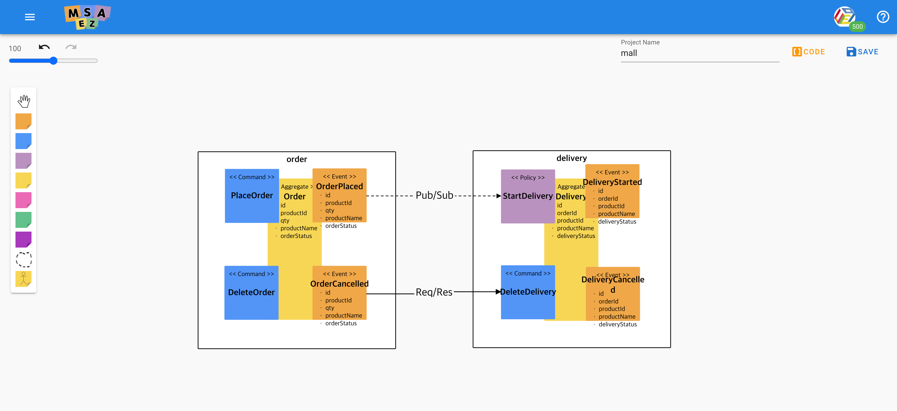
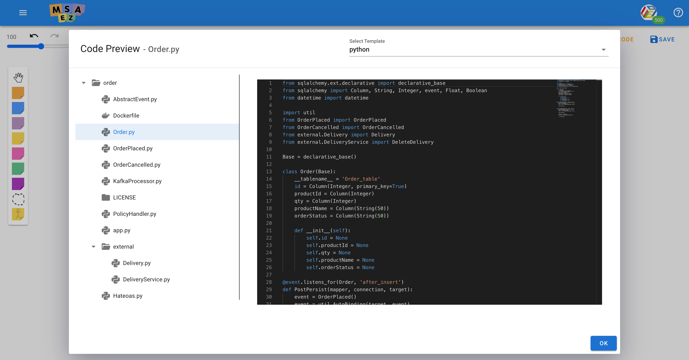
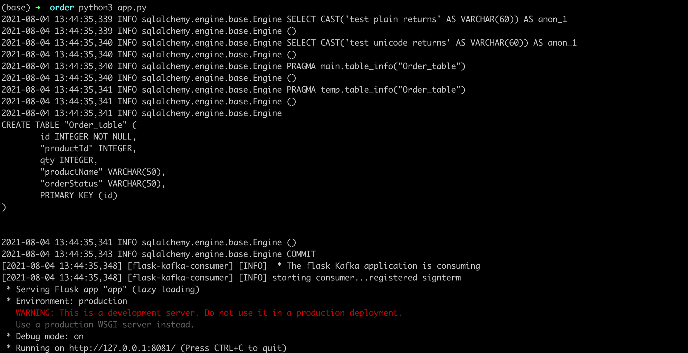

# Python Template 만들기 

## Python DDD Tutorial 

### Model 



Model에 Order 와 Delivery Service 두개가 존재한다. 

<h4> Order </h4>

- Order의 event는 OrderPlaced, OrderCancelled 두개이다. OrderPlaced는 PostPersist로 trigger를 설정하였고 OrderCancelled는 PreRemove로 trigger를 설정하였다. 
- OrderPlaced 즉, 주문됨이라는 event는 Pub/Sub 통신으로 kafka channel에 event를 발행하여 Delivery Service와 통신한다. 
- OrderCancelled 즉, 주문 취소됨 이라는 event는 Res/Req 통신으로 REST API로 Delivery Service와 통신한다. Delivery Service 안에서의 DeliveryCancelled logic이 선행 되고 나서야 OrderCancelled의 logic이 수행된다. 

<h4> Delivery </h4>

- Delivery의 event는 DeliveryStarted, DeliveryCancelled 두개이다. DeliveryStarted는 PostPersist로 trigger를 설정하였고 DeliveryCanclled는 PreRemove로 trigger를 설정하였다. 

### Code 



EventStorming 된 화면에서 우측 상단의 code를 클릭하고 언어를 python으로 설정하면 위와 같은 code가 생성된다. 이를 다운 받고 싶으면 Download Archive를 클릭하면 된다. 

### Test 



<h4> Application 구동하기 </h4>

MSAEZ에서 생성되는 python code는 python version이 최소 3.7 이상이어야 한다.

1. 다운로드 받은 경로로 이동하여 각 Service 파일로 이동한다. 
2. 현 directory에 app.py와 requirements.txt가 존재하는지 확인 한 후 아래와 같은 명령어 입력. (해당 명령어는 필요한 library들을 한꺼번에 설치하는 명령어 이다.)
```bash
pip install -r requirements.txt
```
3. Application을 run 하기 위해 아래와 같은 명령어 입력. 
- OSX 환경 
```bash
python3 app.py
```
- Windows 환경 
```bash
python app.py
```

## Python 기술 Stack 

- Web Framework : Flask 

- ORM : SqlAlchemy 

- Kafka : Flask-kafka(consumer 용), kafka(전반적인)
Python에서는 kafka consumer를 다른 thread에 만들어 channel listening을 하기 때문에 flask-kafka API를 이용. 

- DB : SQlite

- REST Api : requests

## Template Code 만들기에 앞서 

Python Template은 Spring-boot template을 기반으로 구현되었다. Java와 언어적으로 다른 부분에 대해서는 상세 설명에 기술 할 것이다. Spring-boot에 구현되어 있지만 python엔 제공되지 않은 기능들은 따로 구현해 놓았다. 

## Python template 파일 구조

Python template 또한 Spring boot과 마찬가지로 model driven하게 code가 generate 된다. 
Spring-boot와 Python의 비교는 아래와 같다. 

| 역할 | Spring boot | Go |
|-----|-------------|----|
|Aggregate | Entity.java | Entity.py|
|AbstractEvent | AbstractEvent.java | AbstractEvent.py |
|Event | Event.java | Event.py | 
|PolicyHandler | PolicyHandler.java | PolicyHandler.py | 
|PolicyEvent | PolicyEvent.java | PolicyEvent.py |
|ExternalEntity | ExternalEntity.java | ExternalEntity.py |
|ExternalService | ExternalService.java | ExternalService.py |
|Repository | Repoistory.java | Repository.py |
|Controller | Controller.java | Controller.py | 
|Application | Application.java | app.go |
|Kafka | | KafkaProcessor.go | 
|DB | | DB.py | 
|utility | | Util.py | 
|hateoas | | Hateoas.py|

## Model 별 Template 설명 

- 현 섹션에는 eventstorming을 통해 나온 model들을 기반으로 model driven 하게 generate 되는 code들에 대한 설명이다. 

### · Entity.py

- Aggregate code 만들기 

```python
forEach: Aggregate
fileName: {{namePascalCase}}.py
path: {{boundedContext.name}}
---
from sqlalchemy.ext.declarative import declarative_base 
from sqlalchemy import Column, String, Integer, event, Float, Boolean
from datetime import datetime

import util
{{#events}}
from {{namePascalCase}} import {{namePascalCase}}
{{#relationCommandInfo}}
{{#commandValue}}
from external.{{aggregate.namePascalCase}} import {{aggregate.namePascalCase}}
from external.{{aggregate.namePascalCase}}Service import {{namePascalCase}}
{{/commandValue}}
{{/relationCommandInfo}}
{{/events}}

Base = declarative_base()

class {{namePascalCase}}(Base):
    __tablename__ = '{{namePascalCase}}_table'
    {{#aggregateRoot.fieldDescriptors}}
    {{#isKey}}
    {{nameCamelCase}} = Column(Integer, primary_key=True)
    {{/isKey}}
    {{^isKey}}
    {{nameCamelCase}} = Column({{#typeCheckinEntity className}}{{/typeCheckinEntity}})
    {{/isKey}}
    {{/aggregateRoot.fieldDescriptors}}

    def __init__(self):
        {{#aggregateRoot.fieldDescriptors}}
        self.{{nameCamelCase}} = None
        {{/aggregateRoot.fieldDescriptors}}

{{#lifeCycles}}
@event.listens_for({{../namePascalCase}}, '{{#triggerCheck trigger}}{{/triggerCheck}}')
def {{trigger}}(mapper, connection, target):
    {{#events}}
    event = {{namePascalCase}}()
    event = util.AutoBinding(target, event)

    event.Publish()
    
    {{#relationCommandInfo}}
    {{#commandValue}}
    {{aggregate.nameCamelCase}} = {{aggregate.namePascalCase}}()
    response = {{namePascalCase}}({{aggregate.nameCamelCase}})

    print(response)
    {{/commandValue}}
    {{/relationCommandInfo}}
    {{/events}}

    
{{/lifeCycles}}


<function>
    window.$HandleBars.registerHelper('typeCheckinEntity', function (className) {
        if(className.endsWith("String")){
            return "String(50)"
        }
		else if(className.endsWith("Integer")){
			return "Integer"
		}
		else if(className.endsWith("Float")){
			return "Float"
		}
		else if(className.endsWith("Long")){
			return "Integer"
		}
		else if(className.ensWith("Boolean")){
			return "Boolean"
		}
		else if(className.ensWith("Double")){
			return "Float"
		}
		
    });

    window.$HandleBars.registerHelper('triggerCheck', function (trigger) {
        if(trigger.endsWith("PreRemove")){
            return "before_delete"
        }
        else if(trigger.endsWith("PostRemove")){
            return "after_delete"
        }
		else if(trigger.endsWith("PrePersist")){
			return "before_insert"
		}
		else if(trigger.endsWith("PostPersist")){
			return "after_insert"
		}
		else if(trigger.endsWith("PreUpdate")){
			return "before_update"
		}
		else{
			return "after_update"
		}
    });
    
</function>
```

<h4> HandlerBar function </h4>

- typeCheckinEntity 

Java 변수 type을 python에 맞는 변수 type으로 변환 해 준다. Python에서 entity class의 변수형들은 기본적인 python 변수 형과 다른 형태로 존재하지만 변수 형의 종류는 동일하다. Python에선 long과 double이 없어 int, float으로 대체하였다. 

- triggerCheck 

event에서의 trigger를 확인한 후 python SqlAlchemy에 맞는 trigger로 변환해준다. 

| Java 			| Python	|
|---------------|-----------|
|PostPersist 	|after_insert|
|PrePersist 	|before_insert|
|PostUpdate 	|after_update|
|PreUpdate 		|before_update|
|PostDelete		|after_delete|
|PreDelete		|before_delete|


<h4> 세부 사항 </h4>

- Aggregate 당 하나의 Entity.py를 만든다. 
- Entity class 안에 있는 __tablename__이 .db 파일과 mapping되는 class라는 것을 명시해준다. 
- @event.listen_for() 이라는 annotation이 db의 상태를 지속적으로 listen하여 trigger 역할을 수행한다. 

### · AbstractEvent.py 

- Event class에 들어가는 공통적인 변수와 method들이 구현 되어 있는 AbstractEvent code 만들기 

```py
from datetime import datetime

import KafkaProcessor

class AbstractEvent:
	eventType : str
	timeStamp : str

	def __init__(self):
		self.eventType = self.__class__.__name__
		self.timeStamp = str(datetime.now())

	def ToJson(self):
		return self.__dict__

	def Publish(self):
		msg = self.ToJson()

		processor = KafkaProcessor.streamhandler
		processor.produce(msg)
```

<h4> 세부 사항 </h4>

- AbstractEvent에는 Event type을 갖고 있는 eventType과 Event 발행 시간을 갖고 있는 timeStamp가 존재한다. 
- 해당 class가 생성 될때 생성된 class의 이름으로 eventType이 초기화 되고 생성된 시간으로 timeStamp가 초기화 된다. 
- ToJson()는 함수 직렬화를 위한 함수이다. 
- Publish()는 kafka channel에 event를 발행시키는 함수이다. 


### · Event.py 

- Event code 만들기 

```py
forEach: Event
fileName: {{namePascalCase}}.py
path: {{boundedContext.name}}
---
from AbstractEvent import AbstractEvent
import json
from datetime import datetime

class {{namePascalCase}}(AbstractEvent):
    {{#fieldDescriptors}}
    {{nameCamelCase}} : {{#typeCheck className}}{{/typeCheck}}
    {{/fieldDescriptors}}
    
    def __init__(self):
        super().__init__()
        {{#fieldDescriptors}}
        self.{{nameCamelCase}} = None
        {{/fieldDescriptors}}


<function>
    window.$HandleBars.registerHelper('typeCheck', function (className) {
        if(className.endsWith("String")){
            return "str"
        }
		else if(className.endsWith("Integer")){
			return "int"
		}
		else if(className.endsWith("Float")){
			return "float"
		}
		else if(className.endsWith("Long")){
			return "int"
		}
		else if(className.ensWith("Boolean")){
			return "bool"
		}
		else if(className.ensWith("Double")){
			return "int"
		}
		
    });
</function>
```

<h4> HandlerBar function </h4>

- typeCheck 

Java 기반 변수 type을 python 변수 type으로 변환해준다. 해당 handlebar function은 기본 python 변수 type으로 변형해준다. 

<h4> 세부 사항 </h4>

- AbstractEvent를 상속 받는다. 

### · PolicyHandler.py 

- PolicyHandler code 만들기 

```py
forEach: BoundedContext
fileName: PolicyHandler.py
path: {{name}}
---
import util
{{#aggregates}}
import {{namePascalCase}}DB
from {{namePascalCase}} import {{namePascalCase}}
{{nameCamelCase}}repository = {{namePascalCase}}DB.repository

{{/aggregates}}

{{#policies}}
{{#relationEventInfo}}
from {{eventValue.namePascalCase}} import {{eventValue.namePascalCase}}

def whenever{{eventValue.namePascalCase}}_{{../namePascalCase}}(data):
    event = {{eventValue.namePascalCase}}()
    event = util.AutoBinding(data, event)
    
    {{#../../aggregates}}
    {{nameCamelCase}} = {{namePascalCase}}()
    {{nameCamelCase}}repository.save({{nameCamelCase}})
    {{/../../aggregates}}
    
{{/relationEventInfo}}
{{/policies}}

```

<h4> 세부 사항 </h4>

- kafka channel에서 해당 되는 event를 수신 했을 때 serialized 되어 있는 message를 uitl의 AutoBinding을 통해 event 객체로 변환 시킨다. 
- 변환된 event 객체를 이용하여 logic을 추가 구현 할 수 있다. 

### · PolicyEvent.py 

- PolicyHandler에서 이용하는 Event code 구현 하기 

```py
forEach: RelationEventInfo
fileName: {{eventValue.namePascalCase}}.py
path: {{boundedContext.name}}
---

from AbstractEvent import AbstractEvent
import json

class {{eventValue.namePascalCase}}(AbstractEvent):
    {{#eventValue.fieldDescriptors}}
    {{nameCamelCase}} : {{#typeCheck className}}{{/typeCheck}}
    {{/eventValue.fieldDescriptors}}
    
    def __init__(self):
        super().__init__()
        {{#eventValue.fieldDescriptors}}
        self.{{nameCamelCase}} = None
        {{/eventValue.fieldDescriptors}}


<function>
    window.$HandleBars.registerHelper('typeCheck', function (className) {
        if(className.endsWith("String")){
            return "str"
        }
		else if(className.endsWith("Integer")){
			return "int"
		}
		else if(className.endsWith("Float")){
			return "float"
		}
		else if(className.endsWith("Long")){
			return "int"
		}
		else if(className.ensWith("Boolean")){
			return "bool"
		}
		else if(className.ensWith("Double")){
			return "int"
		}
		
    });
</function>
```

<h4> 세부 사항 </h4>

- 현 aggregate의 policyHandler와 연결되어 있는 다른 aggregate의 event에 대한 code를 만든다.
- Event.py code와 동일하다 

### · ExternalService.py 

- 외부 Service의 command와 res/req 방식으로 통신하는 logic이 구현되어 있는 ExternalService code 만들기 

```py
forEach: RelationCommandInfo
fileName: {{commandValue.aggregate.namePascalCase}}Service.py
path: {{boundedContext.name}}/external
---
from external.{{commandValue.aggregate.namePascalCase}} import {{commandValue.aggregate.namePascalCase}}
import requests
import json

{{#MethodGet commandValue.restRepositoryInfo.method}}
def {{commandValue.namePascalCase}}(id):
	headers = {'Content-Type':'application/json'}
	ip = "http://localhost:"
	port = "### this should be changed ###"
	target = "/{{commandValue.aggregate.namePlural}}/"+str(id)
	address = ip+port+target

	response = requests.get(address, headers=headers)
	response = response.content.decode('utf8').replace("'", '"')
	
	return response
{{/MethodGet}}

{{#MethodPost commandValue.restRepositoryInfo.method}}
def {{commandValue.namePascalCase}}(obj):
	headers = {'Content-Type':'application/json'}
	ip = "http://localhost:"
	port = "### this should be changed ###"
	target = "/{{commandValue.aggregate.namePlural}}"
	address = ip+port+target
	data = obj.__dict__
	response = requests.post(address,data=data, headers=headers)
	response = response.content.decode('utf8').replace("'", '"')
	'''
    LOGIC GOES HERE
    '''

	return response
{{/MethodPost}}

{{#MethodUpdate commandValue.restRepositoryInfo.method}}
def {{commandValue.namePascalCase}}(id, obj):
	headers = {'Content-Type':'application/json'}
	ip = "http://localhost:"
	port = "### this should be changed ###"
	target = "/{{commandValue.aggregate.namePlural}}/"+str(id)
	data = obj.__dict__
	response = requests.put(address,data=data, headers=headers)
	response = response.content.decode('utf8').replace("'", '"')

	return response
{{/MethodUpdate}}

{{#MethodDelete commandValue.restRepositoryInfo.method}}
def {{commandValue.namePascalCase}}(id):
	headers = {'Content-Type':'application/json'}
	ip = "http://localhost:"
	port = "### this should be changed ###"
	target = "/{{commandValue.aggregate.namePlural}}/"+str(id)

	response = requests.delete(address, headers=headers)
	
	return response
{{/MethodDelete}}	

<function>
	window.$HandleBars.registerHelper('MethodGet', function(method, options){
        if(method.endsWith('GET')){
        	return options.fn(this)
		}
		else{
			return options.inverse(this)
		}
    });
	window.$HandleBars.registerHelper('MethodPost', function(method, options){
        if(method.endsWith('POST')){
        	return options.fn(this)
		}
		else{
			return options.inverse(this)
		}
    });
	window.$HandleBars.registerHelper('MethodUpdate', function(method, options){
        if(method.endsWith('PUT')){
        	return options.fn(this)
		}
		else{
			return options.inverse(this)
		}
    });
	window.$HandleBars.registerHelper('MethodDelete', function(method, options){
        if(method.endsWith('DELETE')){
        	return options.fn(this)
		}
		else{
			return options.inverse(this)
		}
    });
</function>
```

<h4> HandleBar Function </h4>

Method에 따라 method에 맞는 코드를 generate 해야 하기 때문에 method들을 구분할 수 있는 switch/case 와 같은 함수를 구현.

- MethodGet 

Get method 일때 return true 

- MethodPost

Post method 일때 return true

- MethodUpdate 

Update method 일때 return true

- MethodDelete

Delete method 일때 return true 

<h4> 세부사항 </h4>

- req/res 통신 방식에 rest api인 requests library를 사용하였다. 

### · ExternalEntity.py

- res/req 통신으로 연결된 외부 service의 Aggregate에 해당하는 Entity code 만들기

```py
forEach: RelationCommandInfo
fileName: {{commandValue.aggregate.namePascalCase}}.py
path: {{boundedContext.name}}/external
---
{{#commandValue.aggregate}}
class {{namePascalCase}}:
    {{#aggregateRoot.fieldDescriptors}}
    {{nameCamelCase}} : {{#typeCheck className}}{{/typeCheck}}
    {{/aggregateRoot.fieldDescriptors}}

    def __init__(self):
        {{#aggregateRoot.fieldDescriptors}}
        {{nameCamelCase}} = None
        {{/aggregateRoot.fieldDescriptors}}
{{/commandValue.aggregate}}

<function>
    window.$HandleBars.registerHelper('typeCheck', function (className) {
        if(className.endsWith("String")){
            return "str"
        }
		else if(className.endsWith("Integer")){
			return "int"
		}
		else if(className.endsWith("Float")){
			return "float"
		}
		else if(className.endsWith("Long")){
			return "int"
		}
		else if(className.ensWith("Boolean")){
			return "bool"
		}
		else if(className.ensWith("Double")){
			return "int"
		}
		
    });
</function>
```

<h4> 세부사항 </h4>

- Aggregate code와 유사하지만 db table과 mapping이 되어 있지 않다. 외부 aggregate의 정보만 갖고 있는 단순 객체이다. 

### · Repository.py 

- DB와 관련 data logic이 구현된 Repository code 구현하기 

```py
forEach: Aggregate
fileName: {{namePascalCase}}Repository.py
path: {{boundedContext.name}}
---
from flask import Response, request

import {{namePascalCase}}DB
import util
from {{namePascalCase}} import {{namePascalCase}}

repository = {{namePascalCase}}DB.repository

def Create(request):
    entity = {{namePascalCase}}()
    entity = util.AutoBinding(request.json, entity)
    repository.save(entity)

    return entity
    
def Read(request):
    entity_list = repository.list()
    
    return entity_list

def Read_by_id(id, request):
    
    ele = repository.find_by_id(id)

    return ele

def Update(id, request):
    
    ele = repository.update(id, request.json)
    
    return ele

def Delete(id, request):
    ele = repository.delete(id)
    
    return ele
```

<h4> 세부 사항 </h4>

- DB와 관련된 기본적인 CRUD가 구현되어 있다. 
- persistence를 유지 하기 위해 DB code에서 생성된 repository라는 객체를 가져와 DB logic을 수행한다. 
- repository에서 controller로 결과를 반환하게 되는데 이때 오류가 나면 'error'를 반환하고 정상 작동 된다면 각 함수에 맞는 데이터를 반환해준다. 

### · Controller.py 

- REST Api의 기본적인 CRUD가 구현되어 있는 Controller code 만들기 

```py
forEach: Aggregate
fileName: {{namePascalCase}}Controller.py
path: {{boundedContext.name}}
---
from flask import Flask, abort, jsonify, request, Blueprint, Response
import {{namePascalCase}}Repository 
import Hateoas 

bp = Blueprint('{{nameCamelCase}}', __name__, url_prefix='/{{namePlural}}')

@bp.route("", methods=["POST"])
def Post():
    response = {{namePascalCase}}Repository.Create(request)

    response = Hateoas.POST_response(request.base_url, response)
    return response

@bp.route("", methods=["GET"])
def Get():
    response = {{namePascalCase}}Repository.Read(request)
    response = Hateoas.GET_list_response(request.url_root, request.base_url, response)
    
    return response

@bp.route("/<int:id>", methods=["GET"])
def Get_By_Id(id: int):
    response = {{namePascalCase}}Repository.Read_by_id(id, request)

    if response != 'error':
        response = Hateoas.GET_id_response(request.base_url, response)
    else:
        response = Response(response, status=404,mimetype='application/json')
    return response

@bp.route("/<int:id>", methods=["UPDATE"])
def Update(id: int):
    
    response = {{namePascalCase}}Repository.Update(id, request)
    
    if response != 'error':
        response = Hateoas.GET_id_response(request.base_url, response)
    else:
        response = Response(response, status=403,mimetype='application/json')

    
    return response

@bp.route("/<int:id>", methods=["DELETE"])
def Delete(id: int):
    response = {{namePascalCase}}Repository.Delete(id)
    if response == None:
        response = Response(status=200, mimetype='application/json')
    else :
        response = Response(response, status=403,mimetype='application/json')
    
    return response

{{#commands}}
{{#isRestRepository}}
{{/isRestRepository}}
{{^isRestRepository}}
@bp.route("/{{controllerInfo.apiPath}}", methods=["{{controllerInfo.method}}"])
def {{nameCamelCase}}(): # -> 이부분 수정 
    
    '''
    LOGIC GOES HERE
    '''
    return 'hello world!'

{{/isRestRepository}}
{{/commands}}

@bp.errorhandler(404)
def resource_not_found(e):
    return jsonify(error=str(e)), 404

```
<h4> 세부 사항 </h4>

- aggregate 당 controller를 만든다. 
- flask 에서는 Flask() 객체가 있는 파일에서 라우트 함수를 관리해야하는데 이를 다른 파일에서도 관리 할 수 있게 flask 안에 있는 blueprint라는 api를 사용하였다. 
- Controller는 Request에 대한 행위를 결정하기 때문에 request에 따라 해당되는 repository 로직을 call 하며 response한다. 
- Repository를 통해 반환 받은 데이터로 string type의 error 이면 error response를, 정상적인 데이터면 hateoas 방식으로 response를 해준다. 
- RestRepository가 아닌 command일시에는 입력 받은 apiPath로 route과 method를 설정해준다. 

### · app.py 

- application을 실행 할 수 있는 Application code 만들기 

```py
forEach: BoundedContext
fileName: app.py
path: {{name}}
---
from flask import Flask
import KafkaProcessor
{{#aggregates}}
import {{namePascalCase}}Controller
{{/aggregates}}

app = Flask(__name__)

sh = KafkaProcessor.streamhandler

{{#aggregates}}
app.register_blueprint({{namePascalCase}}Controller.bp)
{{/aggregates}}
if __name__ == "__main__":
	sh.consumer.run()
	app.run(debug=True, port={{portGenerated}})

```

<h4> 세부 사항 </h4>

- 하나의 boundedContext에 여러개의 aggregate이 존재 할 수 있으므로 aggregate에 해당하는 모든 controller를 import 한다. 
- kafkaprocessor에 생성되어 있는 streamhandler를 application이 실행되는 시점에 같이 실행시킨다. (이때 kafka consumer를 위한 새로운 thread가 생성된다.)

## Python 전용 template 

- 본 섹션은 Java에선 추상화 되어 있는 부분들을 python 형식으로 구현된 code에 관해 기술 하였다. 
- python에는 In-Memory DB가 존재하지 않기 때문에 SQlite를 사용하였다. 
- Kafka의 producer와 전반적인 kafka 관리를 위해 Kafka Api를 사용하였고 flask thread와 다른 thread에서 listen을 하기 위해 flask-kafka Api를 사용하였다. 

### · DB.py 

- Sqlite DB 만들기 (spring boot tutorial에선 h2 DB를 쓴다.)
- DB와 관련된 모든 logic은 이 코드에서 수행 된다. 

```py
forEach: Aggregate
fileName: {{namePascalCase}}DB.py
path: {{boundedContext.name}}
---
from typing import List

from sqlalchemy import create_engine
from sqlalchemy.orm import sessionmaker

from {{namePascalCase}} import {{namePascalCase}}

class {{namePascalCase}}DB():
    def __init__(self):
        self.engine = create_engine('sqlite:///{{namePascalCase}}_table.db', echo=True, connect_args={'check_same_thread': False})

        {{namePascalCase}}.__table__.create(bind=self.engine, checkfirst=True)

    def list(self):
        DBsession = sessionmaker(bind=self.engine)
        session = DBsession()
        
        query = session.query({{namePascalCase}}).all()
        return query
    
    def save(self, entity):
        DBsession = sessionmaker(bind=self.engine)
        session = DBsession()
        
        session.add(entity)
        session.commit()
    
    def find_by_id(self, id:int):
        DBsession = sessionmaker(bind=self.engine)
        session = DBsession()
        try:
            query = session.query({{namePascalCase}}).filter_by(id=id).one()
        except Exception as err:
            print(type(err))
            return err
        else:
            return None
            
    def update(self, id, request):
        DBsession = sessionmaker(bind=self.engine)
        session = DBsession()
        
        try:
            query = session.query({{namePascalCase}}).filter({{namePascalCase}}.id==id).first()
            query_dict = query.__dict__
            for key, value in request.items():
                if key in query_dict:
                    setattr(query, key, value)
                
        except Exception as err:
            print(err)
            return err
        else:
            session.commit()
            return query
            
    def delete(self, id):
        DBsession = sessionmaker(bind=self.engine)
        session = DBsession()
        
        try:
            query = session.query({{namePascalCase}}).filter_by(id=id).one()
            session.delete(query)
        except Exception as err:
            print('error:',err)
            return err
        else:
            session.commit()
            return None

repository = {{namePascalCase}}DB()
```

<h4> 세부 사항 </h4>

- create_engine()으로 .db 파일을 만들고 이를 해당 entity class와 binding 시킨다. 
- create_engine() 인자에서 connect_args는 다른 thread에서도 db에 접근 할 수 있게 설정한다. 이는 kafka consumer에서 해당되는 eventType인 event가 들어왔을 때 logic을 수행 할 수 있게 해준다. 
- db에 저장하는 함수는 save로 entity class가 인자로 들어간다. 
- db에서 전체 데이터를 읽어오는 함수는 list이고 id를 key로써 갖고 오는 함수는 find_by_id 이다. 
- db에서 한 record를 update하는 함수는 update이고 인자로는 dict 형태로 들어간다. 
- db에서 한 record를 삭제하는 함수는 delete으로 인자로 id가 들어간다. 
- Persistence를 유지하기 위해 db 파일에서 db 객체를 초기화 하여 다른 파일에서도 같은 context를 유지할 수 있다. 

### · KafkaProcessor.py 

```py
forEach: BoundedContext
fileName: KafkaProcessor.py
path: {{name}}
---
from kafka import KafkaProducer
from flask_kafka import FlaskKafka
from threading import Event
import json
{{#policies}}
{{#relationEventInfo}}
from PolicyHandler import whenever{{eventValue.namePascalCase}}_{{../namePascalCase}}
{{/relationEventInfo}}
{{/policies}}

class StreamHandler():
	
	def __init__(self):
		INTERRUPT_EVENT = Event()
		self.destination = "{{options.package}}"
		self.group_id = "{{name}}"
		self.producer = KafkaProducer(acks=0, compression_type='gzip', bootstrap_servers=['localhost:9092'], value_serializer=lambda x: json.dumps(x).encode('utf-8'))
		self.consumer = FlaskKafka(INTERRUPT_EVENT,
		         bootstrap_servers=["localhost:9092"],
		         group_id= self.group_id
		         )


	def produce(self, msg):
		self.producer.send(self.destination, value=msg)

streamhandler = StreamHandler()

@streamhandler.consumer.handle(streamhandler.destination)
def consume(msg):
    my_json = msg.value.decode('utf8').replace("'", '"')
    data = json.loads(my_json)
    {{#policies}}
    if data['eventType'] == {{#relationEventInfo}}"{{eventValue.namePascalCase}}"{{/relationEventInfo}}:
        {{#relationEventInfo}}
        whenever{{eventValue.namePascalCase}}_{{../namePascalCase}}(data)
        {{/relationEventInfo}}
    {{/policies}}
```

<h4> 세부 사항 </h4> 

- kafka에 관련한 전반적인 config을 StreamHandler에서 초기화 해준다. 
- @streamhandler.consumer.handle 이란 annotation은 그 아래 오는 함수를 새로운 thread에서 실행 시켜준다. 
- consume() 함수에서 channel listening을 통해 받아온 message를 deserialize하여 eventType을 구분하여 해당 함수를 call한다. 

### · util.py 

- Java에 존재하는 autobinding 기능이 python엔 존재하지 않는다. 이를 직접 구현한 code 

```py
def AutoBinding(source, target):
	
	if isinstance(source, dict) == True:
		source_dict = source
	else:
		source_dict = source.__dict__
	
	target_dict = target.__dict__

	for key, value in source_dict.items():
		if key in target_dict:
			setattr(target,key,value)

	return target

``` 

<h4> 세부 사항 </h4>

- AutoBinding은 dict type 혹은 class 와 class를 mapping 해주는 함수이다. 
- dict 형태로 들어오는 request를 entity class로 binding 할때와 kafka channel을 통해 들어오는 message를 event class로 binding 할때와 entity class와 event class를 binding 할때 쓰인다. 

### · Hateoas.py 

- Response를 Hateoas 형식으로 변환 해주기 위한 모듈 

```py
forEach: BoundedContext
fileName: Hateoas.py
path: {{name}}
---
import json
from collections import OrderedDict

def GET_id_response(base_url, entity):
	response=OrderedDict()
	entity_name = entity.__class__.__name__.lower()

	response['_links'] = {
		entity_name :{ 					
			'href':base_url
		},
		'self':{
			'href':base_url
		}
	}

	entity_dict = entity.__dict__
	for key, value in entity_dict.items():
		if key != '_sa_instance_state' and key != 'id':
			response[key] = value
	return response

def POST_response(base_url, entity):
	response = OrderedDict()
	url = base_url + '/'+ str(entity.id)
	entity_name = entity.__class__.__name__.lower()

	response['_links'] = {
		entity_name: {
			'href': url
		},
		'self':{
			'href': url
		}
	}
	
	entity_dict = entity.__dict__
	for key, value in entity_dict.items():
		if key != '_sa_instance_state' and key != 'id':
			response[key] = value
	return response

def GET_list_response(url_root,base_url,entity_list):
	totalElements = len(entity_list)
	size = 20
	number = totalElements//size
	response = OrderedDict()
	obj_list = []

	for ele in entity_list:
		obj_dict = OrderedDict()
		ele_dict = ele.__dict__
		ele_name = ele.__class__.__name__.lower()
		url = base_url + '/'+str(ele.id)
		
		obj_dict['_list'] = {
			ele_name: {
				"href":url
			},
			"self":{
				"href":url
			}
		}
		
		for key, value in ele_dict.items():
			if key != '_sa_instance_state' and key != 'id':
				obj_dict[key] = value

		obj_list.append(obj_dict)

	target = base_url.split("/")[-1]
	response['_embedded'] = obj_list
	response['_links'] = {
		'profile' : {
			'href': url_root+"profile/"+target
		},
		'self':{
			'href': base_url+"{?page,size,sort}",
			'templated': True
		}
	}
	response['page']={
		'number': str(number),
		'size': str(size),
		'totalElements':str(totalElements),
		'totalPages': str(number+1)
	}
	return response
```

<h4> 세부 사항 </h4>

- GET_id_response는 id를 key로 가져온 entity에 대한 response 형식을 만들어 주는 함수이다. 인자로는 entity class가 들어 간다.
-POST_response 는 post method에 관한 response 형식을 만들어 주는 함수이다. 인자로는 post 받은 entity class가 들어간다. 
- GET_list_response 는 모든 record를 가져 올때의 response 형식을 만들어 주는 함수이다. 인자로는 entity class의 list 형태로 들어 간다. 


