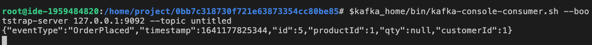

# 클라우드 IDE

## 화면 구성 및 메뉴

<h3>전체화면</h3>

- 기본적으로 vscode의 화면 구성과 같습니다.

>| 번호 | 설명               |
>|------|--------------------|
>|   1  | 프로젝트 파일 영역 |
>|   2  | 코드 작성 영역     |
>|   3  | 터미널 영역        |

>

<br>

<h3>메뉴 구성</h3>

### File

- File의 메뉴 구성은 다음과 같습니다.
  - New File: 새로운 파일을 추가
  - New Folder: 새로운 폴더를 추가
  - New Window: 새로운 IDE를 실행
  - Open...: 어떤 것을 열 건지 선택
  - Open Workspace: 작업영역 열기
  - Open Recent Workspace: 최근 작업 영역 열기
  - Save Workspace As...: 작업 영역을 다른 이름으로 저장
  - Save: 작업 영역 저장
  - Save All: 전체 작업 영역 저장
  - Auto Save: 자동 저장
  - Upload Files...: 자신의 파일 불러오기
  - Download: 현재 작업 내용 내 PC에 다운로드
  - Preferences: 사용중인 Ide 대하여 여러가지 설정
  - Close Editor: 편집기 닫기
  - Close Workspace: 작업영역 닫기

>

<br>

### Edit

- Edit의 메뉴 구성은 다음과 같습니다.
  - Undo: 했던 행동에 대해서 한번 되돌리기
  - 지웠던(삭제) 했던 행동에 대해서 한번 앞으로 감기
  - Cut: 선택 영역 자르기
  - Copy: 선택 영역 복사하기
  - Paste: 붙여넣기
  - Copy Path: 경로 복사
  - Find: windows의 control + F와 같습니다. 해당 영역에서 검색어로 찾기
  - Replace: 바꾸기
  - Find in Files: 파일 찾기
  - Replace in Files: 파일에서 바꾸기

>

<br>

### Selection

- Selection의 메뉴 구성은 다음과 같습니다.
  - Select All: 모두 선택
  - Expand Selection: 선택 영역 확장
  - Shrink Selection: 선택 축소
  - Copy Line Up: 라인 위로 복사
  - Move Line Up: 최상단으로 이동
  - Move Line Down: 최하단으로 이동
  - Duplicate Selection: 선택 항목 중복
  - Add Cursor Above: 위쪽으로 커서 포인트 추가
  - Add Cursor Below: 아래쪽으로 커서 포인트 추가
  - Add Cutsors to Line Ends: 선 끝에 절단기 추가
  - Add Next Occurrence: 다음 항목 추가
  - Add Previous Occurrence: 이전 항목 추가
  - Select All Occurrence: 커서 포인트에 위치한 단어 전체 선택

>

<br>

### View

- View의 메뉴 구성은 다음과 같습니다.
  - Command Palette...: 명령 팔레트
  - Open View: 사용 가능한 항목 열기
  - Call Hierarchy: 호출 계층
  - Debug: 오류
  - Debug Console: 디버그 콘솔창 열기
  - Explorer: 현재 작업 영역 파일 위치 찾기
  - Extensions: 플러그인 창 열기
  - Outline: 아웃라인 창 열고 닫기
  - OutPut: 하단 터미널 영역 열고 닫기
  - Plugins: 커서 포인트 위치 단어 전체 선택
  - Problems: 하단 Problems 영역 열고 닫기
  - References: 참조 사항
  - Search: 전체 검색
  - Source Control: 검색 단어 위치로 이동
  - Test: 왼쪽 하단 플러스크 아이콘 영역으로 이동
  - Type Hierarchy: 계층 유형
  - Toggle Bottom Panel: 아래쪽 패널 전환
  - Toggle Statys Bar: 통계량 막대 전환
  - Collapse All Side Panels: 모든 측면 패널 축소
  - Toggle Word Wrap: 자동 줄 바꿈 전환
  - Toggle Minimap: 미니맵 전환
  - Toggle Render Whitespace: 렌더 공백 전환

>

<br>

### Go

- GO의 메뉴 구성은 다음과 같습니다.
  - Go Back: 뒤로감기
  - Go Forward: 앞으로감기
  - Last Edit Location: 마지막 위치 편집
  - Go to File...: 파일로 이동
  - Go to Symbol in Workspace...: 작업영역의 기호로 이동
  - Go to Symbol in Editor...: 편집기에서 기호로 이동
  - Go to Definition: 정의로 이동
  - GO to Declaration: 선언으로 이동
  - Go to Type Definition: 유형 정의로 이동
  - Go to Implementation: 구현으로 이동
  - Go to References: 참조로 이동
  - Go to Line/Column...: 선/열로 이동
  - Go to Bracket: 브래킷으로 이동
  - Next Problem: 다음 문제
  - Previous Problem: 이전 문제

>

<br>

### Labs

- Labs의 메뉴 구성은 다음과 같습니다.
  - 새 터미널: 새로운 터미널 열기
  - 결과 제출: 터미널의 현재 보이는 부분이 캡처되어 진행 중인 실습의 정보가 강사에게 보내집니다.
  - 포트 열기: localhost:8080등을 직접 주소창을 열어 넣지 않아도 해당 포트로 자동으로 열어집니다.
  - 도움 요청: 결과 제출과 마찬가지로 현재 오류 부분을 터미널에 띄워놓고 도움 요청을 클릭하면 강사에게 터미널 영역이 캡처되어 보내집니다.
  - 포트 확인: 현재 사용 중인 포트 번호를 확인할 수 있습니다.
  - 도커 종료: 실행 중인 도커를 종료합니다.
  - Spring-boot 모두 종료: 실행중인 스프링 부트 서버 모두 종료
  - Start Kafka Server: 카프카 서버 실행
  - Start Zookeeper Server: 주키퍼 서버 실행

>

<br>

- Run의 메뉴 구성은 다음과 같습니다.
  - Start Debugging: 디버그 모드 실행
  - Start Without Debugging: 디버깅 없이 시작
  - Stop: 실행중인 상태 멈춤
  - Restart: 다시 시작
  - Open Configurations: 구성 열기
  - Add Configuration...: 구성 추가
  - Toggle Breakpoint: 중단점 전환
  - New Breakpoint: 새 중단점
  - Enable All Breakpoints: 모든 중단점 사용
  - Disable All Breakpoints: 모든 중단점 사용 안 함
  - Remove All Breakpoints: 모든 중단점 제거

>

<br>

- Terminal의 메뉴 구성은 다음과 같습니다.
  - New Terminal: 새 터미널 열기
  - Split Terminal: 터미널 분할
  - Run Task...: 작업 실행
  - Run Build Task: 빌드 작업 실행
  - Run Test Task: 테스트 작업 실행
  - Rerun Last Task: 마지막 작업 다시 실행
  - Show Running Tasks...: 실행 중인 작업 표시
  - Terminate Task...: 작업 종료
  - Attach Task...: 작업 연결
  - Configure Tasks...: 작업 구성

>

<br>

- Help의 메뉴 구성은 다음과 같습니다.
  - Getting Started: 최초 화면 열기

>

## 아이콘

| 번호 | 아이콘 | 설명                                                                               |
|------|--------|------------------------------------------------------------------------------------|
|   1  |  | 현재 프로젝트를 확인할 수 있습니다.              |
|   2  |  | 전체 영역에서 검색할 수 있습니다.                |
|   3  |  | 연결된 저장소를 확인합니다.                      |
|   4  |  | 디버그 및 실행 가능한 영역을 확인할 수 있습니다. |
|   5  |  | 활용 가능한 플러그인 목록을 확인할 수 있습니다.  |
|   6  |  | 각종 테스트 목록을 확인할 수 있습니다.           |

## 클라우드 IDE 실습 예제

<iframe style="width:100%" height="315" src="https://www.youtube.com/embed/h_2dgG7-2kk" title="YouTube video player" frameborder="0" allow="accelerometer; autoplay; clipboard-write; encrypted-media; gyroscope; picture-in-picture" allowfullscreen></iframe>

---

<br>

### 이벤트 스토밍

**페이지 상단의 실습하기 버튼을 클릭하여 실습 사이트에 접속합니다.**

- 접속 후 EventStorming의 이미지 또는 CREATE 버튼을 클릭합니다.


<br>

**왼쪽의 팔레트에서 스티커를 드래그하여 예제 이벤트 스토밍을 그려줍니다.**

- 도구에 대한 설명은 좌측 메뉴 -> 도구 사용법 -> 이벤트 스토밍을 참조하십시오.


<br>

**우측 상단의 CODE 또는 CODE에 마우스 오버 시 튀어나오는 Code Preview를 클릭해 줍니다.**

- 생성된 이벤트 스토밍에 대한 Code를 확인할 수 있습니다.


<br>

**Code Preview 창의 우측 상단의 모드를 통해 다양한 언어로 전환 후 확인이 가능합니다.**


<br>

### IDE사용

<br>

**이제 이벤트 스토밍 창의 CODE에 마우스 오버 후 Project IDE를 클릭해줍니다.**


<br>

**이렇게 Web version의 IDE가 나타나는 것을 확인할 수 있습니다.**
- 기본적으로 docekr, kubernetes, http 등의 환경이 내장되어 있습니다.
- 다른 필요한 도구가 있다면 리눅스에서 다운로드하는 방식으로 다운로드할 수 있습니다.


<br>

- Docker


<br>

- Kubernetes


<br>

- Http


<br>


**order 서비스에서 발생하는 메시지가 정상적으로 카프카 서버에 등록이 되는지와 컨슈머 역할을 하는 delivery 컨슘이 되는지 확인해 보겠습니다.**
- 1. 상단 메뉴의 Labs의 Start Kafka Server를 클릭해서 카프카 서버를 실행시켜 줍니다.
  - 우측 하단에 카프카 서버가 정상적으로 실행되었다는 메시지를 확인할 수 있습니다.


<br>

- 2. 상단 메뉴의 Labs의 Kafka Consumer을 클릭합니다.


<br>

- 3. topic의 name는 이벤트 스토밍의 Project Name와 같습니다.


<br>

- 4. Kafka Consumer 클릭 -> 생성된 명령어 뒤에 한 칸 띄고 Project Name을 작성합니다.


<br>

---

<br>

### 서비스 실행
**order 서비스를 등록하기 위해 order의 root로 이동해 줍니다.**
- mvn spring-boot:run 명령어를 사용하여 스프링 부트 서버를 실행해 줍니다.

```javascript
mvn spring-boot:run
```


<br>

- order 서비스가 port8081에 뜬것을 확인할 수 있습니다.


<br>

- order서비스에 접근이 가능한지 확인 해보기 위해서 새로운 터미널에서 확인해보겠습니다.
- http를 이용해 아래 명령어를 적용하여 order 서비스에 정상적으로 접근을 할 수 있습니다.
- src/main/java/project/orderRepository.java의 path가 orders이고 order 서비스가 port8081로 떠있기 때문에 localhost:8081/orders로 접근하였습니다.
```javascript
http localhost:8081/orders
```


<br>

- orders에 customerId=1, qty=3, productId=1들의 값을 넣으면 localhost:8081/orders에 정상적으로 값이 담긴 것을 확인할 수 있습니다.
```javascript
http localhost:8081/orders customerId=1 qty=3 productId=1
```


<br>

- 주문을 넣게 되면 topic 명령어를 실행했던 곳에서 토픽이 추가된 것을 확인할 수 있습니다.


