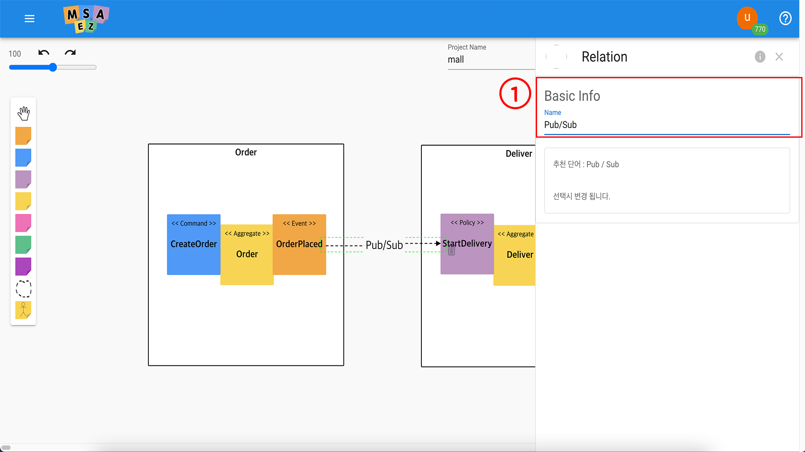
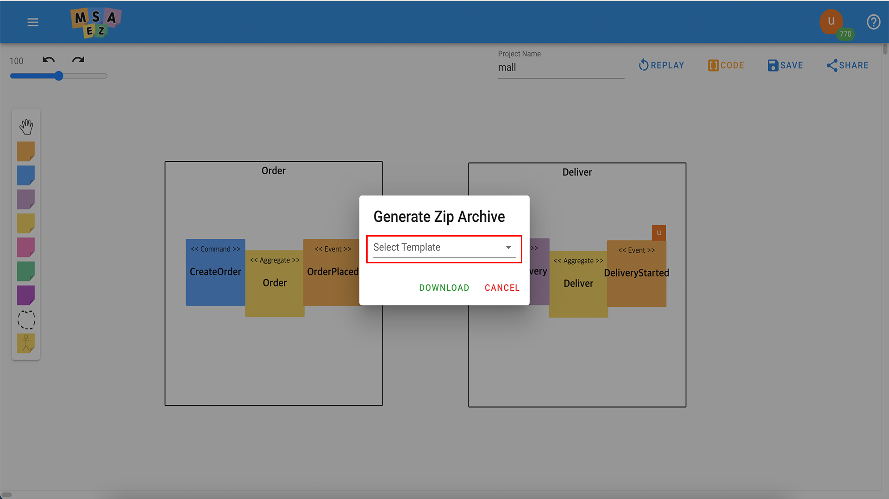
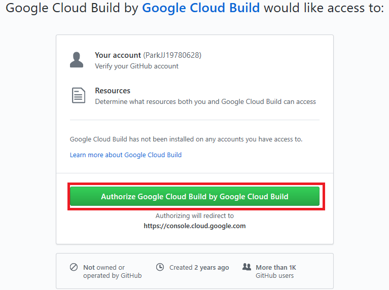
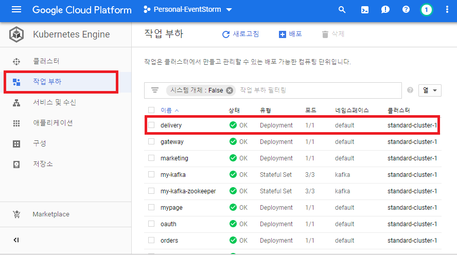

# 이벤트 스토밍

<h2>MSA Easy로 MSA 개발하기</h2>

## 서비스 접속
[msaez.io](http://www.msaez.io) 에 접속합니다.
<br/>(크롬 브라우저 추천)

<h2>예제 프로젝트</h2>

예제 프로젝트는 주문 서비스와 배송 서비스 2개의 서비스를 EventStorming하여 Spring-boot로 실행되는 Java Project를 생성하고 이들을 구글클라우드의 쿠버네티스에 자동 배포하는 과정입니다.

## UI 소개

<h3>UI 레이아웃</h3>

MSAEZ 도구의 전체 화면 레이아웃은 다음과 같습니다.

> 
> <p align="center"> 그림 1 도구 전체 레이아웃 </p>

| 번호 | 이름                | 기능 설명                                                        |
|------|---------------------|----------------------------------------------------------------- |
| 1    &nbsp;| Zoom Panel          | 캔버스에 작성된 화면을 확대 및 축소 기능                         |
| 2    &nbsp;| Project Name        | 프로젝트 명 입력 (Java의 경우 Package명)                         |
| 3    &nbsp;| Replay              | 모델링 히스토리 정보를 확인하는 기능                             |
| 4    &nbsp;| Code                | 모델링 한 code 확인 기능                                         |
|ㆍ4-1 &nbsp;| Code Preview        | 모델링 한 code 다운로드 기능                                     |
|ㆍ4-2 &nbsp;| Download Archive    | 모델링 한 code 실습하는 기능                                     |
|ㆍ4-3 &nbsp;| Project IDE         | 모델링 한 code 확인, 다운로드, 실습하는 기능                     |
| 5    &nbsp;| Save                | Draw된 EventStorming파일을 Json파일로 저장함                     |
|ㆍ5-1 &nbsp;| Save to Server      | 모델링 한 sticker 정보를 서버에 저장하는 기능                    |
|ㆍ5-2 &nbsp;| Download model File | 모델링 한 sticker 정보를 내 pc에 저장 하는 기능                  |
|ㆍ5-3 &nbsp;| Duplicate           | 모델링 한 sticker 정보를 서버에 복제하는 기능                    |
| 6    &nbsp;| Share               | 유저 간 모델링 공유를 통한 동시편집 기능                         |
| 7    &nbsp;| Sticker Palette     | EventStorming을 위한 Sticky note를 선택할 수 있는 Palette        |


### ·	Event Sticker
스티커 팔레트에서 오랜지색 아이콘이 Event를 지칭합니다.

<h4>Event 속성 설정</h4>

추가된 Event 스티커를 더블 클릭하게 되면, 오른쪽에 아래와 같이 속성 창이 나타나며,
<br/> 각 속성 설정에 대한 값은 아래와 같습니다.

> 

| 번호 | 이름                 | 기능 설명                            |
| ---- | -------------------- | ------------------------------------ |
| 1    | Event Name           | Event Sticky note에 작성될 이름      |
| 2    | Trigger              | Event를 발생시키는 엔티티의 Trigger  |
| 3    | Attribute            | Event의 Attribute들 등록             |
| 4    | Associated Aggregate | Event와 연결 될 Aggregate 선택       |

주문팀의 주문 시나리오에 따라 아래와 같이 기입합니다.

1.  Event Name에 “**OrderPlaced**” 라고 기입합니다.

2.  Trigger는 "PrePersist"를 선택합니다.

3.  Attribute는 Event에서 사용할 Entity를 등록합니다.  
    기본적으로는 아래의 4. 에서 Aggregate가 연결됩니다면 해당 Aggregate의 Entity정보를 참조합니다.

4.  연결될 Aggregate를 선택합니다. (이후에, Aggregate를 추가한 후에 선택하여 줍니다.)

배송팀은 배송 시나리오에 따라 Event를 생성하여 줍니다.

1.  Event Name에 “**DeliveryStarted**” 라고 기입합니다.

2.  Trigger는 PostUpdate를 선택합니다.

3.  Attribute는 Event에서 사용할 Entity를 등록합니다.  
    기본적으로는 아래의 4. 에서 Aggregate가 연결됩니다면 해당 Aggregate의 Entity정보를 참조합니다.

4.  연결될 Aggregate를 선택합니다. (이후에, Aggregate를 추가한 후에 선택하여 줍니다.)

### ·	Policy Sticker

Policy는 스티커 팔레트에서 라일락색 아이콘이 지칭합니다.

> 

<h4>Policy 속성 설정</h4>

추가된 Policy 스티커를 더블 클릭하게 되면, 오른쪽에 아래와 같이 속성 창이 나타나며,
<br /> 각 속성 설정에 대한 값은 아래와 같습니다.

| 번호 | 이름                   | 기능 설명                        |
| ---- | ---------------------- | -------------------------------- |
| 1    | Policy Name            | Policy Sticky note에 작성될 이름 |

해당 이벤트가 발생될 때의 업무에 따라서, 아래와 같이 기입합니다.

1.  Policy Name에 “**StartDelivery**” 라고 기입합니다.

### ·	Command Sticker

Command는 스티커 팔레트에서 파란색 아이콘이 지칭합니다.

<h4>Command 속성 설정</h4>

추가된 Command 스티커를 더블 클릭하게 되면, 오른쪽에 아래와 같이 속성 창이 나타나며,
<br /> 각 속성 설정에 대한 값은 아래와 같습니다.

> 

| 번호 | 이름                       | 기능 설명                         |
| ---- | -------------------------- | --------------------------------- |
| 1    | Command Name               | Command Sticky note에 작성될 이름 |
| 2    | Restful Type               | Restful API 의 CRUD Type을 선택   |
| 3    | Associated Aggregate       | Command와 연결 될 Aggregate 선택  |

해당 이벤트가 발생될 때의 업무에 따라서, 아래와 같이 기입합니다.

1.  Command Name에 “**CreateOrder**” 라고 기입합니다.

2.  Restful Type은 POST로 설정합니다.

3.  연결될 Aggregate를 선택합니다. (이후에, Aggregate를 추가한 후에 선택하여 줍니다.)

### ·	Aggregate Sticker

Aggregate는 스티커 팔레트에서 노란색 아이콘이 지칭합니다.

<h4>어그리게잇 속성 설정</h4>

추가된 Aggregate 스티커를 더블 클릭하게 되면, 오른쪽에 아래와 같이 속성 창이 나타나며, 각 속성 설정에 대한 값은
아래와 같습니다.

> 

| 번호 | 이름              | 기능 설명                                      |
| ---- | ----------------- | ---------------------------------------------- |
| 1    | Aggregate Name    | Aggregate Sticky note에 작성될 이름            |
| 2    | Attributes        | Aggregate Entity (Domain Entity)를 정의합니다. |

주문 서비스의 Aggregate(Domain Entity)를 정의하기 위해, 아래와 같이 기입합니다.

1.  Aggregate Name에 “**Order**” 라고 기입합니다.

2.  Aggregate의 Entity(Domain Entity)를 정의하여 줍니다.  
    해당 서비스에서는 Type은 String인 Name이라는 Entity를 추가하여 줍니다.

배송 서비스의 Aggregate(Domain Entity)를 정의하기 위해, 아래와 같이 기입합니다.

1.  Aggregate Name에 “**Delivery**” 라고 기입합니다.

2.  Aggregate의 Entity(Domain Entity)를 정의하여 줍니다.  
    해당 서비스에서는 Type은 String인 Address라는 Entity를 추가하여 줍니다.

Aggregate를 추가 하였다면 각 Event, Command, Policy들의 Associate Aggregate를 설정하여,
<br />Aggregate를 지정하여 줍니다.

### ·	Bounded Context Sticker

Bounded Context는 스티커 팔레트에서 점선 모양의 아이콘이 지칭합니다.

<h4>Bounded Context 속성 설정</h4>

> 

| 번호 | 이름                   | 기능 설명                       |
| ---- | ------------------------ | ----------------------------- |
| 1    | Bounded Context Name     | Bounded Context에 작성될 이름 |

주문 서비스의 Bounded Context와 배송 서비스의 Bounded Context를 그린 후,
<br />각각의 서비스에 맞게 EventStorming의 Sticky Note들을
<br />각 Bounded Context에 Drag & Drop으로 넣어줍니다.

상기 작성된 4.2.2부터 4.2.6까지의 작업을 완료하면 아래와 같은 형태의 EventStorming 결과물이 나옵니다.

### ·	Relation

Relation은Event 스티커에서 Policy 스티커로 연결되는 선을 지칭합니다.

<h4>Relation 추가</h4>

Event 스티커에서 화살표 모양 아이콘을 선택,
<br />또는 Drag 하여 연결될 Policy 스티커를 선택 또는 Drop하면 연결됩니다.

> 

<h4>Relation 속성 설정</h4>

> 

| 번호 | 이름 | 기능 설명                                                                                                                   |
| ---- | -----| --------------------------------------------------------------------------------------------------------------------------- |
| 1    | Type | Event-Driven형식의 Pub/Sub 방식을 사용할 것인지, <br />또는 Request & Response 방식의 Restful API 방식을 사용할 것인지 설정 |

주문 서비스의 OrderPlaced의 이벤트가 발생할 경우 StartDelivery가 시작되도록 연결하는데
<br />어떠한 방식으로 StartDelivery를 시작하게 할 것인지를 설정하여 줍니다.

1.  Event-Driven 방식의 Pub/Sub 방식으로 설정하여 줍니다.

<h4>EventStorming 결과</h4>

위의 이벤트 스토밍이 완료되면 아래 그림과 같이 나옵니다.

> 

### ·	Code Preview

Code Preview를 선택하면 EventStorming 된 결과를 Code Preview를 통하여 Code로 변환된 결과를
확인 할 수 있습니다.

<h4>코드 프리뷰 레이아웃</h4>

> 
> <p align="center">그림 20 코드 프리뷰 레이아웃</p>

| 번호 | 이름               | 기능 설명                                                                            |
| -- | -------------------- | ------------------------------------------------------------------------------------ |
| 1  | Code List            | 선택된 Template에 따라서 생성된 폴더 구조와 파일들을 보여줌                          |
| 2  | Select<br />Template | Template 중에서 어떤 Template을 사용하여<br />코드 생성 및 코드 확인 할 것인지 선택  |
| 3  | Code View            | 선택된 파일의 Code를 표시해 줌                                                       |

### ·	Download Archive

Download Archive를 선택하면 Template을 선택할 수 있으며, EventStroming 된 결과를 Zip파일로
다운로드 받을 수 있습니다.

> 

| 번호 | 이름              | 기능 설명                                                                            |
| ---- | ----------------- | ------------------------------------------------------------------------------------ |
| 1    | Select Template   | Template 중에서 어떤 Template을 사용하여<br />코드 생성 및 다운로드 받을 것인지 선택 |

## 빌드

### ·	다운로드 파일 구조 설명

  - Bounded Context 에 설정한 이름별(Order, Delivery)로 프로젝트가 생성이 되었고,
    c압축을 풀었을 시 아래와 같은 구조를 가진다.

  - 

  - gateway 는 기본 제공되는 템플릿으로 spring-cloud-gateway 를 설정하는 방법을 나타내고있습니다.
    정상적으로 사용시에는 gateway/src/main/resource 의 application.yaml
    파일에서 routes 부분을 수정하여 사용하여야 합니다.

  - 파일 구조는 아래와 같이 스티커별로 기본 템플릿에 의하여 생성이 되었다.  
    spring-boot 기반의 프로젝트 이며, maven 으로 리소스 관리를 합니다.  
    파일 생성 위치나, 파일 안의 기본 내용을 생성시마다 변경을 하려면 다음 장의 커스텀 템플릿을 활용하면 됩니다.

> 

  - application.yaml
    
      - spring-boot 의 설정 파일이며, local 환경 변수와 Docker용 환경변수를 profile 설정으로
        분리하였다.
    
      - 이벤트 기반이기 때문에 메시지 처리를 위하여 spring-cloud-stream 라이브러리를 사용합니다. 그 중에서
        브로커를 kafka 를 사용하여 설정되어있습니다.

  - Dockerfile
    
      - Docker image 를 생성할 때 필요한 파일이다.
    
      - Docker 로 build 시 "--spring.profiles.active=docker" 로 설정되어 있어서
        application.yaml 파일에서 설정한 프로파일을 읽게 됩니다.

  - cloudbuild.yaml
    
      - Google Cloud Build 에서 사용하는 pipeline 파일이다.
    
      - 기본설정으로 test-build-docker build-publish-deploy 단계가 설정되어있습니다.
    
      - Docker publish 단계에서는 GCR (Google Container Registry) 에 이미지를
        배포합니다.
    
      - Deploy 단계에서는 GKE 에 배포를 하게 되는데 이때 주의사항은 클러스터 이름과 Zone 을 설정해 줘야합니다.
        아래 3가지 항목을 사용자에 맞추어 필수적으로 변경을 해줘야 합니다.
        
          - substitutions._PROJECT_NAME: 항목에서 어떤 service 와 deploy 명으로
            배포를 할지 정해지는데, 해당 부분을 변경해 줘야합니다.
        
          - CLOUDSDK_COMPUTE_ZONE: 설정되어있는 Zone 은 도쿄(asia-northeast1-a)
            로 설정이 되어있습니다.
        
          - CLOUDSDK_CONTAINER_CLUSTER: 클러스터 이름은 standard-cluster-1 으로
            default 클러스터 이름이다.

<h4>선행사항</h4>

  - maven 설치
  - local kafka 실행 – localhost:9092

### ·	실행

  - 메이븐 프로젝트이기 때문에 mvn spring-boot:run 으로 실행을 합니다.

  - 정상적으로 실행이 되었다면 브라우저에 localhost:8081 (port 는 프로젝트별로 다르기 때문에 설정파일 참조)
    을 적어보면 Aggregate 에 설정하였던 속성값들이 HATEOAS 수준으로 정상적으로 나오는지를 확인합니다.

  - Command 에 작성하였던 get, post 등의 메서드가 정상적으로 호출되는지 확인합니다.

### ·	클라우드 배포

이번 가이드항목은 작동하는 소스코드를 github 에 올리고 GCB 트리거를 생성하여 자동 빌드되고 배포되는 방법을 guide
합니다.

### ·	Git 연동

  - GCB 는 git repository 를 현재까지 github, google code, bitbucket 을 지원합니다. 본
    가이드는 이중에서 github 에 코드를 넣는 방법을
    설명합니다.

  - [<span class="underline">https://github.com/</span>](https://github.com/)
    에서 레파지토리를 생성합니다.

  - 레파지토리를 생성 하고 git 주소가 생성이 됩니다

  - github 에 올리려는 프로젝트에서 아래와 같은 스크립트를 실행하여 github 에 source 를 push 합니다.

  - git init

  - git commit –m ‘commit message’ .

  - git push \<github 주소\>

### ·	GCB Trigger 생성

GCB 트리거 생성은 아래와 같은 순서대로 진행을
합니다.
<br>

1. GCP 의 GCB 메뉴로 들어가서 트리거 메뉴를 클릭합니다.  
> 
<br><br><br>

2. 상단의 저장소 연결 버튼을 클릭합니다.
> 
<br>

3. 저장소 선택에서 github을 선택합니다.
> 
<br><br><br>

4. 깃헙 인증을 하여 진행합니다.
> 
<br><br><br>

5. 연결할 프로젝트를 선택하여 저장소 연결을 마무리 합니다.
> 
<br><br><br>

6. 상단의 트리거 생성 버튼을 클릭하여 트리거를 생성합니다.
> 
<br><br><br>

7. 트리거 생성 화면의 하단에 빌드 구성을 CloudBuild 로 선택합니다.
>
<br><br><br>

8. 트리거 만들기 버튼을 클릭하여 트리거생성을 완료합니다. 오른쪽의 트리거 실행버튼으로 바로 트리거 실행을 할 수 있습니다. 
> 
<br><br><br>

위와 같이 트리거를 생성하였으면, github 에 push 명령을 실행할 때마다, 트리거가 작동하는 것을 확인 할 수 있습니다.

### ·	쿠버네티스 배포

<h4>쿠버네티스 배포 확인</h4>

  - 트리거가 정상적으로 실행을 하였으면 기록 메뉴에서 빌드 성공/실패 여부를 확인 할 수있습니다.

> 

  - 빌드 기록에 녹색으로 성공화면이 떠있으면 GKE 에 성공적으로 배포가 된 것이다. GKE 메뉴의 작업 부하 항목에서 현재
    동작하는 서비스를 확인 할 수
있습니다.

> 

### ·	배포 실패시 해결방법

* 빌드 실패시 기록 항목에서 아래와 같이 빨간색으로 빌드 실패가 나타나고, 클릭시 어떤 step 에서 에러가 났는지 확인이 가능하다. 로그 다운로드 버튼을 눌러서 상세 로그를 확인하면서 해결이 가능하다.

> 

> 

* deploy 단계에서 에러가 났을 경우 첫번째로 GCB 에서 GKE 로 배포를 하는 권한이 있는지 체크해 보고, 없을 때 권한 설정을 해줍니다.

> Cloud빌드 – 설정 메뉴에서 Kubernetes Engine 개발자가 사용설정됨 으로 상태가 보이는지 확인하고,
> 안되어있을시 사용 설정합니다.

> 

* cloudBuild.yaml 파일의 option 부분에 클러스터 Zone 과 이름이 일치하는지 확인 합니다.

```css
options :  
    env:  
    ## location/name of GKE cluster (used by all kubectl commands)  
    - CLOUDSDK_COMPUTE_ZONE=asia-northeast1-a  
    - CLOUDSDK_CONTAINER_CLUSTER=standard-cluster-1
```
