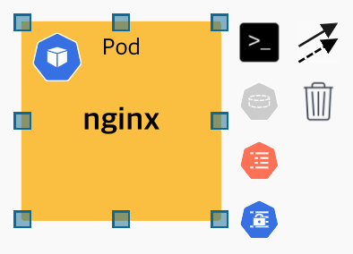
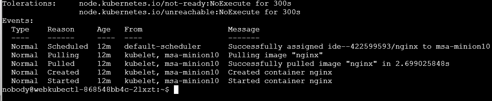
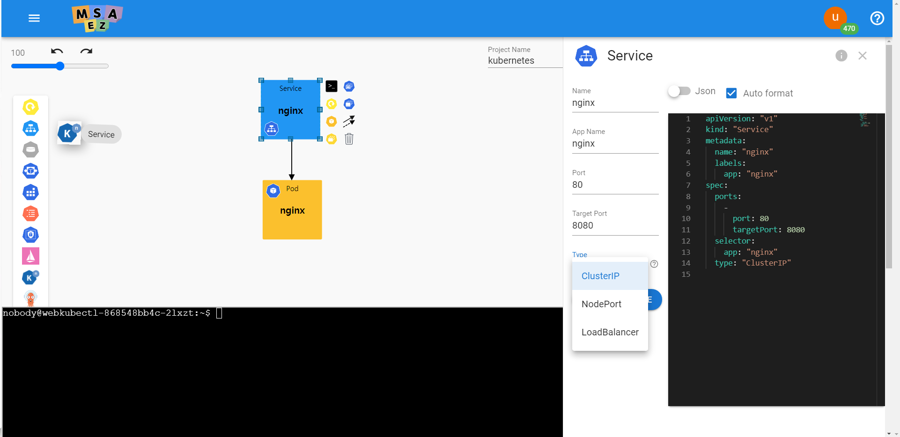
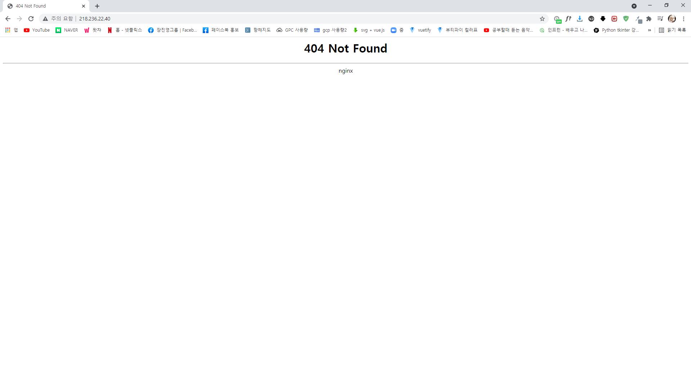

# 인프라 모델링 (쿠버네티스)

<div style = "height:400px; object-fit: cover;">
<iframe style = "width:100%; height:100%;" src="https://www.youtube.com/embed/vtPtymnmo6M" title="YouTube video player" frameborder="0" allow="accelerometer; autoplay; clipboard-write; encrypted-media; gyroscope; picture-in-picture" allowfullscreen></iframe>
</div>

## Getting started
Kuber-Ez는 Yaml 및 CLI에 대한 최소한의 이해만으로도 kubernetes 매니페스트 및 배포 모형을<br>
구성할 수 있는 시각적 방식의 웹 기반 다이어그래밍 도구입니다.

**사이트rul: [쿠버네티스 시작하기](http://www.msaez.io/#/)**

- 우측 상단의 + NEW에서 Kubernetes Deploy Diagram 클릭해 줍니다.


<br/>


## Quick Tour

<h3>화면 구성</h3>

<!-- https://user-images.githubusercontent.com/48265118/92880687-3d82e580-f449-11ea-81cf-e5a2c00ac6f1.png 원본 이미지 -->


***

<h3>1. 팔레트 영역</h3>

Kubernetes 오브젝트 팔레트 영역으로 쿠버네티스 객체 목록을 그룹화하여 각 카테고리별로 나눠져 있습니다.

<h3>오브젝트 팔레트</h3>

| 카테고리 | 오브젝트 | 설명 |
|:-------:|:-------:|:----:|
| Workload | Namespace<br/>Deployment<br/>ReplicaSet<br/>Pod<br/>StatefulSet<br/>DaemonSet | 쿠버네티스의 기본 Object와<br/>Desired State를 유지하기 위한<br/>컨트롤러 객체들의 집합 |
| Routing | Service<br/>Ingress | Workload 객체을 외부에서<br/>접근할 수 있도록 서비스하는 객체 |
| Persistence | PersistentVolume<br/>PersistentVolumeClaim<br/>StorageClass | 쿠버네티스 스토리지를 관리하기<br/>위한 볼륨 리소스 집합 |
| Autosalcer | HorizontalPodAutoscaler | CPU, 메모리의 사용량을 관찰하여<br/>리소스의 파드 개수를<br/>자동으로 스케일하는 객체 |
| Job | Job<br/>CronJob | 지정된 수의 파드가 성공적으로<br/>실행되어 종료되도록 하는<br/>컨트롤러 객체들의 집합 |
| Configuration | ConfigMap<br/>Secret | 다른 객체가 사용할 데이터를<br/>저장하는 객체들의 집합 |
| Role Based Access Control<br/>(RBAC) | Role<br/>RoleBinding<br/>ClusterRole<br/>ClusterRoleBinding<br/>ServiceAccount | 사용자의 역할을 기반으로<br/>쿠버네티스 시스템의 권한을<br/>관리하는 객체들의 집합 |
| Istio | Gateway<br/>VirtualService<br/>DestinationRule<br/>ServiceEntry<br/>Sidecar<br/>Quota<br/>Rule<br/>QuotaSpec<br/>QuotaSpecBinding<br/>MemQuota |  |
| Knative | Service |  |
| Argo | Workflow |  |

***


<br/>

<h3>2. 메뉴 영역</h3>

우측 상단에 표시되는 클러스터 연결 및 배포, 생성된 YAML 코드의 관리를 위한 기능으로 상세 설명은 다음과 같습니다.

1) Manage Clusters : 사용자의 클러스터를 등록 및 삭제할 수 있으며 등록된 클러스터를 클릭하여 사용할 클러스터를 선택할 수 있습니다.

톱니바퀴 버튼 클릭시 호출되는 Manage Clusters 화면


+버튼을 클릭하여 이름, 클러스터의 API Server, token을 입력하여 저장하면 화면에 입력한 클러스터 정보가 등록됩니다. 사용할 클러스터는 등록된 클러스터를 클릭하여 선택합니다.
<p>


</p>


2) Deploy : 캔버스에 모델링된 객체를 서버에 배포해주는 버튼으로 사용자가 선택한 클러스터가 있는 경우 사용할 수 있습니다.

Deploy 버튼 클릭시 나오는 팝업창. 배포할 클러스터 정보를 확인하고 Deploy 버튼을 누르면 캔버스에 모델링된 객체들이 배포됩니다.


3) Code Preview : Code Preview, Download Archive 두가지 메뉴가 있으며 Code Preview 클릭시 캔버스에 모델링한 객체의 Yaml 파일을 Template에 따라 미리볼 수 있습니다.<br>
Download Archive 클릭시 선택한 Template에 따른 Yaml 파일이 다운로드 됩니다.

Code Preview를 클릭하여 Template에서 Separate File per kind를 선택한 화면

<br><br>

원하는 Template별로 모델링 객체의 Yaml을 확인할 수 있습니다.

<br><br>

Download Archive를 클릭하여 호출된 팝업창. 원하는 Template을 골라 Yaml 파일을 다운로드 할 수 있습니다.


<br><br>


***

<br/>

<h3>3. 커맨드 영역</h3>

Kubernetes CLI 명령어를 출력하는 Shell 영역으로 캔버스 상에 객체를 정의하고,<br>
객체의 컨텍스트 메뉴에서 명령어를 클릭시 Shell 영역에 해당 커맨드가 출력됩니다.<br>
**오브젝트의 context menu에서 터미널 오픈**
<P>


<p>

<h3>메뉴를 통한 kubectl get deployment 명령어 호출</h3>

<p>


<p>

***

<br/>

<h3>4. 캔버스 영역</h3>
오브젝트 팔레트에서 선택한 객체가 구현되는 영역으로 오브젝트를 더블클릭시,<br>
해당 객체의 프로퍼티를 수정할 수 있는 편집창이 나와 추가적인 정의를 할 수 있습니다.<br>
<br>

**UI 편집창을 통한 프로퍼티 정의**


## Tutorial

<h3>pod 추가 및 터미널 오픈</h3>

**pod를 추가하고 터미널을 open 해줍니다.**
>


| 번호 | 이름                | 기능 설명                                                                 |
| ---- | ------------------- | ------------------------------------------------------------------------- |
| 1    | pod                 | pod 추가                                                                  |
| 2    | terminal            | 내부 터미널 작동                                                          |

**터미널 클릭시 화면**
>


**pod를 더블 클릭하여 아래와 같이 세팅 해줍니다.**
- Name: nginx
- Image: nginx
- Port: 8080

>

>

**labels 과 Containers 설명**<br>

labels 이란 쿠버네티스에서 나를 조회할 때 사용하는 태그입니다.<br>
- App라고 하는 태그로 된 nginx
- nginx라고 된 애플리케이션

Containers(복수형)란 기본적으로 프로세스라고 생각하면 됩니다.
- 하나의 pod 안에 하나 이상의 프로세스가 뜰 수 있기 때문에

### ·	Pod
**kubectl create pod(pod를 생성하는 명령어입니다.)**

- 아래 이미지의 터미널 아이콘을 클릭하여 kubectl create pod를 클릭합니다.

>

>

```
pod/nginx created
```

<br><br>

**kubectl get pod nginx(nginx pod 상태를 확인하는 명령어입니다.)**

>

- 명령어 입력 시 아래와 같이 출력 됩니다.
>

<br><br>

**kubectl describe pod nginx(nginx pod 상세정보를 확인하는 명령어입니다.)**
>

- 결과화면
>

### ·	Service

**Service를 더블 클릭하여 아래와 같이 세팅 해줍니다.**
- Name: nginx
- Image: nginx
- Target Port: 8080
- Type: ClusterIp

**Type의 ClusterIp와 LoadBalancer의 차이점**
- clusterIp(쿠버네티스 내부에서만 접근하도록 하는 설정) - 보안 적합
- LoadBalancer (외부에서도 접근할 수 있게 설정) - 보안 부적합


<br><br>


**화살표 아이콘을 클릭하여 pod(nginx) 에 연결해 줍니다.**

>
<br><br>

**kubectl create service(service를 생성하는 명령어입니다.)**
>
```
service/nginx created
```


### ·	Ingress
<h4>Ingress(API 게이트 대문 역할)</h4>

- Ingress란 하나의 API 게이트웨이입니다.

**Ingress를 더블 클릭하여 아래와 같이 세팅해 줍니다.**
- Name: main
>

<br><br>

**kubectl create ingress(ingress를 생성하는 명령어입니다.)**
>

>

- 결과화면
```
ingress.extensions/main created
```
<br><br>

**kubectl get ingress(ingress 상태를 확인하는 명령어입니다.)**
>

- 결과화면
>

<br><br>

**ADDRESS의 아이피 주소로 접속**
- 결과화면(kubectl get ingress로 획득한 ADDRESS의 아이피 주소)
>

